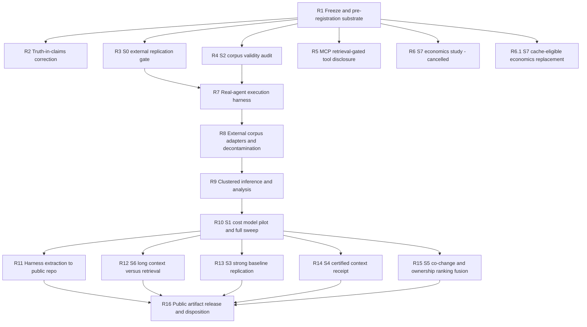
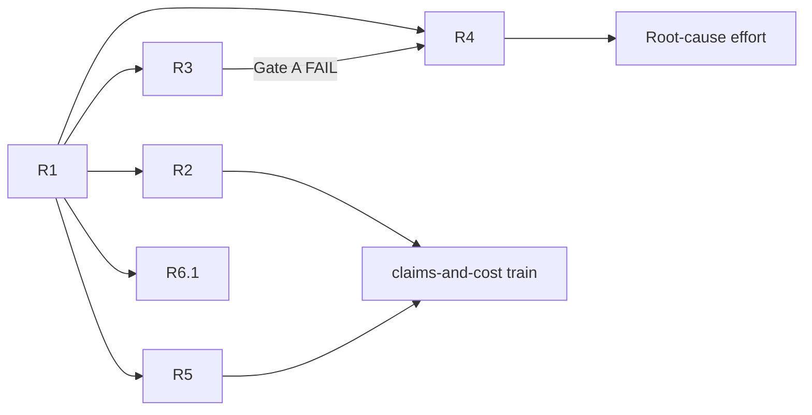
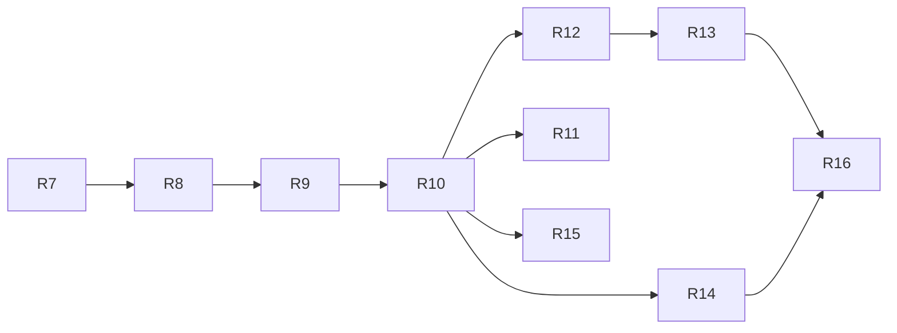

# Development Plan — archex Strategic Reassessment Program

## 1. Context & Source Map

This plan operationalizes `.docs/strategic-reassessment/`, which concluded that archex's evidence base is a closed loop (self-authored labels, no model ever in the benchmark loop, primary metric at ceiling) and that ~29 mechanism lanes produced nulls that license no claim in either direction. The program's trunk is therefore **build an instrument that can detect an effect**, not **build a 30th mechanism**. Product work that carries no research risk runs in parallel from day one.

Milestones are prefixed `R` (reassessment). **Do not reuse `M1`–`M17`** — that numbering is permanently bound to the prior plan by tracked references in `CHANGELOG.md` and `benchmarks/results/m*/DECISION.md`.

| Plan section | Milestones | Source |
| --- | --- | --- |
| §6 Section A — Freeze & truth-in-claims | R1, R2 | `05-ROADMAP.md` §1 (Phase 0); `04-PRODUCT-AND-ECONOMICS.md` §1.1–1.3; `00-DIAGNOSIS.md` §1.1, §5 |
| §6 Section B — Validity gates | R3, R4 | `05-ROADMAP.md` §2 Lanes A–B; `03-SPIKES.md` S0, S2; `00-DIAGNOSIS.md` §1.2–1.4, §2 |
| §6 Section C — Zero-research-risk product wins | R5, R6, R6.1 | `05-ROADMAP.md` §2 Lane C; `03-SPIKES.md` S7; `01-LITERATURE-POSITION.md` §G6; `00-DIAGNOSIS.md` §3 |
| §6 Section D — The instrument | R7–R11 | `05-ROADMAP.md` §3; `03-SPIKES.md` S1; `02-STRATEGY.md` §C1; `04-PRODUCT-AND-ECONOMICS.md` §2 |
| §6 Section E — Payload | R12–R15 | `05-ROADMAP.md` §4; `03-SPIKES.md` S3–S6; `01-LITERATURE-POSITION.md` §G2–G5 |
| §6 Section F — Publication & disposition | R16 | `05-ROADMAP.md` §4 Gate C; `02-STRATEGY.md` §C1 elements 1–7 |
| §4 Release trains | all | `04-PRODUCT-AND-ECONOMICS.md` §3, §5; repo `CHANGELOG.md` `[Unreleased]`; `pyproject.toml` |
| §7 Cross-cutting | all | `03-SPIKES.md` preamble; `skill://null-result-benchmark-study-design` |

## 2. Assumptions & Gaps

> DECISION `R1-DG-001`: `.docs/DEVELOPMENT_PLAN.md`, `.docs/EXECUTION_PROMPTS.md`, and `.docs/spikes/**` are tracked exceptions to the developer workspace. `.docs/DEVELOPMENT_PLAN_HISTORY.md` remains ignored and reconstructible local evidence; all other `.docs/` paths remain local. When a developer's global ignore also excludes `.docs/`, force-add the tracked exceptions. Without this exception, required pre-registrations cannot merge before runs and commit order cannot prove their timing.

> ASSUMPTION: The prior `.docs/DEVELOPMENT_PLAN.md` is absent from disk while `CHANGELOG.md` and four `benchmarks/results/m*/DECISION.md` files still cite its section numbers. Those citations are treated as immutable historical references. This plan supersedes the prior plan's forward milestones (its M2, M3, M10, M4, M5 were never started) and does not renumber history.

> ASSUMPTION: `CHANGELOG.md` `[Unreleased]` already carries prior-M6–M9 entries (conditional semantic / runtime / history / documentation evidence infrastructure, all shipped disabled-by-default after measuring zero improvement). Any release train that fires will carry those entries with it. No milestone here re-litigates them.

> ASSUMPTION: Prior M7/M8/M9 built working, revision-bound collectors in `archex.integrations.runtime`, `archex.integrations.history` (git log, 200-commit window, issue/PR reference extraction), and `archex.integrations.docs` (doc links, ADRs, ownership) that are **never read by search, ranking, or expansion** — which is exactly why they measured bit-for-bit identical to control. R15 reuses those collectors rather than rebuilding them.

> ASSUMPTION: R7's real-agent driver extends the existing opt-in `archex benchmark bundle-eval` lane (`src/archex/benchmark/bundle_eval.py`) rather than adding a parallel harness.

> GAP: **No release version is source-traceable.** `.docs/strategic-reassessment/` names no version, tag, or publication requirement. `pyproject.toml` reads `0.24.0` and publication is manual (tag → `uv build`/`uv publish` → GitHub release; no release CI workflow exists). Every release train below therefore carries `> GAP:` for its target; an operator selects the version at preparation time. Do not infer one.

> GAP: **R10's inference budget is unpriced.** `05-ROADMAP.md` §3 estimates $500–1 500 for ≈3 240 agent runs but explicitly labels it `[INFERENCE]`. R10's PR-1 computes the real figure against current pricing before any sweep is authorized. A figure materially above the operator's ceiling is a `DESIGN NO-GO` for R10, not a reason to shrink the cluster count.

> GAP: **The model and scaffold to hold fixed in R7 are unnamed.** The source docs specify "fixed model, fixed scaffold, temperature 0, N≥3 seeds" without naming either. R7's design gate must fix and record both; changing them later invalidates every downstream comparison.

## 3. Dependency Graph

Gate A sat on R3's verdict and blocked R7. **It failed on 2026-07-28** (`GATE-A.md`), so R7–R16 are cancelled and Gates B and C never come into play. The graph above is the plan as designed; §8 records what remains.

## 4. Release Trains

| Target release | Included milestones | Preparation trigger | Required artifacts | Verification | Publication |
| --- | --- | --- | --- | --- | --- |
| `> GAP: version not source-traceable — operator selects at preparation time` (train **claims-and-cost**) | `R2, R5` | Both externally merged. Carries the pre-existing `[Unreleased]` prior-M6–M9 entries. | both (version update in `pyproject.toml` + `CHANGELOG.md`) | `uv run ruff check . && uv run ruff format --check . && uv run pyright . && uv run pytest` all green on the release commit; `uv run archex mcp-schema-size --format json` reports the reduced total | `git tag` → `uv build` → `uv publish` → `gh release create`. Manual; no release CI workflow exists. |
| `> GAP: version not source-traceable — operator selects at preparation time` (train **certified-receipt**) | `R14` | R14 externally merged **and** its promotion verdict is GO. | both | full gate above, plus R14's certificate correlation artifact checked in | same manual sequence |
| `unversioned` | `R1, R3, R4, R6.1, R7, R8, R9, R10, R12, R13, R15` | n/a — merged to `main`, no release preparation. | none | per-milestone verification in §6 | not requested |
| `none` | `R11, R16` | n/a — artifacts land in a separate public repository, not in the `archex` distribution. | none | per-milestone verification in §6 | separate-repo release, out of scope for `archex` versioning |
| `none` (cancelled) | `R6` | n/a — invalid study closed without merge. | none | validity record in §6 | not requested |

A milestone in the `unversioned` set that later proves user-visible moves to a train only by a plan revision recorded under §5.

## 5. Plan Evolution Protocol

- The committed-by-convention plan and prompt files (`.docs/DEVELOPMENT_PLAN.md`, `.docs/EXECUTION_PROMPTS.md`) are authoritative. `.docs/DEVELOPMENT_PLAN_HISTORY.md` is reconstructible local evidence.
- Before each milestone, inspect its plan row, its prompt, the source map, the current codebase, merged predecessor diffs, predecessor verification/CI evidence, and the history ledger when available.
- Record exactly one `DESIGN GO — PLAN REVISION: none`, `DESIGN GO — PLAN REVISION: <entry IDs>`, or `DESIGN NO-GO — REASON: <blocking evidence>`.
- A material mismatch updates the current milestone and every directly or transitively affected future milestone in both authoritative files, then recomputes §3, §4, and §8.
- `DESIGN NO-GO` blocks code, branches, and implementation PRs. A material revision requires a docs-only reconciliation PR that is reviewed, green, and externally merged before implementation.
- **Gates A, B, and C are declared in advance and are not renegotiable after seeing results.** A gate outcome is recorded as a ledger entry and, for Gate A and Gate B, also as a checked-in evidence artifact under `benchmarks/evidence/`. Changing a gate's threshold after data exists is a plan violation, not a revision.

## 6. Sections & Milestones

### Section A — Freeze and truth-in-claims

#### R1 — Planning freeze and pre-registration substrate

| Field | Value |
| --- | --- |
| Objective | Stop mechanism work and establish the pre-registration discipline under which every later result becomes interpretable. |
| In / Out of scope | In: suspend prior forward milestones; contribution policy; make the authoritative plan, prompts, and `.docs/spikes/TEMPLATE.md` tracked exceptions; history ledger creation. Out: any product-code change, any experiment. |
| Depends on | `none` |
| Target release | `unversioned` |
| Deliverables | Prior forward milestones marked `SUSPENDED — pending strategic-reassessment Gate A` with a pointer to `.docs/strategic-reassessment/`; a freeze clause in `CONTRIBUTING.md` prohibiting new retrieval lanes, default-promotion attempts, new language tiers, and new MCP tools until Gate A; a tracked `.docs/spikes/TEMPLATE.md` requiring hypothesis, primary metric, SESOI, separately-derived MWG/NIM/EQM (EQM strictly positive, utility-derived), clustering unit, kill criterion, and evidence class (replication / adaptation / original); `.docs/DEVELOPMENT_PLAN_HISTORY.md` seeded. |
| Acceptance | `.docs/spikes/TEMPLATE.md` is tracked and enumerates all eight required fields. `CONTRIBUTING.md` contains the freeze clause naming the four prohibited change classes and Gate A as the lift condition. `git check-ignore -v .docs/DEVELOPMENT_PLAN_HISTORY.md` exits 0. No file under `src/` changed. |
| Verification | `git ls-files --error-unmatch .docs/spikes/TEMPLATE.md` exits 0; `git check-ignore -v .docs/DEVELOPMENT_PLAN_HISTORY.md` exits 0; `git diff --name-only <base>..HEAD -- src/` prints nothing; `uv run ruff check . && uv run ruff format --check . && uv run pyright . && uv run pytest` green. |
| Design reevaluation | Confirm no forward milestone from the prior plan was silently resumed after 2026-07-24. Dependents requiring review if this changes: R2, R3, R4, R5, R6, R6.1. |
| Risks & rollback | Risk: a freeze is ignored or a pre-registration remains invisible to commit-order review. Mitigation: the `CONTRIBUTING.md` clause and tracked `.docs/spikes/` exception are reviewable artifacts. Rollback: revert the stack. |
| Est. PRs | 2 |

#### R2 — Truth-in-claims correction

| Field | Value |
| --- | --- |
| Objective | Stop publishing numbers that cannot survive scrutiny, before anyone challenges them. |
| In / Out of scope | In: savings-headline re-baselining, `downstream_success_rate` renaming, cross-tool baseline annotation. Out: changing how any number is computed; deleting historical artifacts. |
| Depends on | `R1` |
| Target release | train **claims-and-cost** (`> GAP:` version) |
| Deliverables | README and `docs/LOCAL_METRICS.md` savings headline re-pointed at `savings_pct_vs_targeted_read` (`src/archex/metrics/math.py`); the self-repo row withdrawn from every quoted figure; `benchmarks/cross-tool-efficiency/` and `docs/LOCAL_BENCHMARK_EVIDENCE.md` annotated with the `tokens_at_recall` blind-read semantics (`src/archex/benchmark/cross_tool.py`) and the measured median/mean/max units-read distribution; `BenchmarkScorecardRow.downstream_success_rate` renamed `required_file_completeness_rate` (`src/archex/benchmark/scorecard.py`) with its docstring stating it is a function of required-file recall and that no model is in the loop; `CHANGELOG.md` `[Unreleased]` entry. |
| Acceptance | No tracked file quotes `445×`, `673×`, `99.78%`, or `99.64%`. Every remaining savings figure names its baseline in the same sentence. `grep -r downstream_success_rate src/ tests/ docs/` returns no hits. The scorecard markdown column header reads `Required-File Completeness`. Full gate green. |
| Verification | `grep -rn "downstream_success_rate\|445×\|673×\|99\.78\|99\.64" src tests docs README.md benchmarks/*.md` returns nothing; `uv run pytest tests/ -k "scorecard or metrics or cross_tool"` green; full gate green. |
| Design reevaluation | Re-confirm `savings_pct_vs_targeted_read` is populated on the live ledger path before re-pointing the headline at it. Dependents: R6, R6.1, R10, R16. |
| Risks & rollback | Risk: a rename breaks a checked-in evidence reader. Mitigation: `archex benchmark validate --kind evidence` over every artifact in `benchmarks/evidence/` before merge. Rollback: revert the stack; no data is destroyed. |
| Est. PRs | 3 |

### Section B — Validity gates

#### R3 — S0 external replication gate `BLOCKING`

| Field | Value |
| --- | --- |
| Objective | Establish whether this harness can reproduce any result anyone else has published. Everything downstream is uninterpretable without it. |
| In / Out of scope | In: reproducing RLCoder (arXiv:2407.19487, ICSE'25) in **its own** reference setup as the primary arm; recording what the cAST (arXiv:2506.15655) arm establishes about reproducibility; recording the Gate A verdict. Out: running either mechanism inside archex; changing archex retrieval. |
| Depends on | `R1` |
| Target release | `unversioned` |
| Deliverables | `.docs/spikes/S0-replication-gate.md` pre-registered from `TEMPLATE.md` and merged **before** any run, fixing the target cell and the equivalence band in advance; a reproduction harness under `benchmarks/replication/` pinned by upstream commit, dataset revision, model revision, and generation settings; `benchmarks/evidence/s0-rlcoder-replication.json` recording the reproduced delta with a bootstrap interval; `benchmarks/evidence/s0-cast-replication.json` recording the cAST arm's disposition and the evidence behind it; an `archex benchmark validate --kind replication` validator that rejects an artifact missing any pin, class label, or verdict field; a `GATE-A.md` verdict document. |
| Acceptance | The pre-registration is merged before the first run (verifiable by commit order). The reproduction runs in the paper's own setup, not inside archex's pipeline. Because neither paper publishes an interval, seed count, or variance, the verdict states in one line whether the reproduced delta falls inside the **pre-registered equivalence band** around the paper's reported point estimate, and names that band. Arms are labelled `replication` class. |
| Verification | `uv run archex benchmark validate --kind replication --input benchmarks/evidence/s0-rlcoder-replication.json` and the same command over `s0-cast-replication.json` both exit 0; the reproduction command recorded in `GATE-A.md` reruns to the same figure; full gate green. |
| Design reevaluation | Confirm each paper's artifact is still fetchable and its cited figure is still as reported before building the harness. Dependents: R7, R13 — both are void on a Gate A fail. |
| Risks & rollback | Risk: a paper's artifact is unavailable or underspecified, making that arm unrunnable rather than failed. Mitigation: two arms exist for exactly this; an unrunnable arm is recorded as unrunnable and never scored as a pass, and a gate with no runnable arm is `DESIGN NO-GO`. Rollback: revert; no product retrieval code touched. |
| Est. PRs | 4 |

> **Gate A.** Pass = at least one published win reproduced inside its pre-registered equivalence band → R7 is authorized. Fail = no published win reproduces in its own setup → **stop all research work**; every archex null to date is attributable to implementation, R7–R16 are cancelled, and the program reduces to Section A + Section C outputs plus a root-cause engineering effort. An arm that cannot be run at all is neither a pass nor a fail; it is recorded as unrunnable with its blocking evidence, and Gate A is decided by the remaining arms. Recorded in `GATE-A.md` and the ledger. Not renegotiable.

#### R4 — S2 corpus validity audit `BLOCKING`

| Field | Value |
| --- | --- |
| Objective | Quantify exactly how much any corpus this project can assemble is able to detect. Originally framed as grounding R9's margins; **re-scoped 2026-07-28 after Gate A** — R9 is cancelled, and R4's question is now the program's disposition question: R3 measured a +2.8125 delta carrying a 5.8-point cluster interval on an *external* corpus with 8 clean balanced clusters, so whether archex's own corpus can resolve a literature-sized effect is the direct explanation for 25 uninterpretable nulls. |
| In / Out of scope | In: leakage scoring, clustering statistics, held-out leak measurement, power simulation, and a calibration of that simulation against R3's RepoEval corpus. Out: fixing the corpus; deleting tasks; changing retrieval; deriving MWG/NIM/EQM, which existed to feed cancelled R9. |
| Depends on | `R1`, and `R3`'s measured interval as a calibration input |
| Target release | `unversioned` |
| Deliverables | A leakage score for every `benchmarks/tasks/*.yaml` (gold symbol or path appearing verbatim in `question` or `keywords`; 8 of 21 previously confirmed in the `loc_*` family — re-count, do not assume); ICC over repo clusters with the items-per-cluster distribution and largest-cluster share (**re-counted at R4's design gate**: 64 top-level tasks over 16 distinct repo values, largest cluster 24 self-repo = 37.5%; the plan's earlier 66 was wrong); an empirical held-out leak measurement for `benchmarks/held_out.txt` (**corrected at R4's design gate**: the plan previously noted only `archex_project_status` and `archex_query_pipeline` as tuning-set members. In fact all five held-out IDs are top-level tasks in `benchmarks/tasks/` — `tests/benchmark/test_generalization.py:29` asserts exactly that — and no code under `src/` or `.github/` excludes them from a run, so the held-out set is a labelling convention with no runtime separation. R4 must measure and report that, not restate the old note); a power simulation over the measured cluster-size distribution reporting the minimum detectable effect at the current N and how many **independent repositories** would be needed to resolve an effect the size R3 targeted (+4.88 points); the same simulation applied to R3's 8-cluster RepoEval structure and checked against its measured interval width, as a validation point rather than a projection; `benchmarks/evidence/s2-corpus-validity.json`. |
| Acceptance | Every deliverable is present in the artifact. The simulation is validated against R3's measured interval before any projection about archex's corpus is believed. The report states plainly, and in one line, whether any realistic number of independent repositories makes a literature-sized effect detectable here. A negative answer is the expected and acceptable outcome. |
| Verification | `uv run archex benchmark validate --kind replication --input benchmarks/evidence/s2-corpus-validity.json` is **not** applicable — this is an internal measurement, not a replication. R4 names its own validator at its design gate per §7's evidence-artifact rule; the audit script must rerun deterministically to the same figures; full gate green. |
| Design reevaluation | Re-count the corpus before auditing; task counts have changed across milestones and the previously quoted 66 and 64 disagree. Resolve §7's evidence-artifact defect for this milestone's artifact shape. Dependents: none surviving — R9 and R10 are cancelled, so R4's output feeds the disposition decision and the root-cause effort, not a downstream analysis plan. |
| Risks & rollback | Risk: the simulation shows no reachable N for any candidate metric. That is the **finding**, not a failure, and it is the strongest available evidence about what this program can and cannot conclude. Rollback: revert; measurement only. |
| Est. PRs | 3 |

### Section C — Zero-research-risk product wins

R5 shipped regardless of Gate A. R6 is cancelled because its session fixture never reached the cache-eligibility floor. R6.1 is a separately authorized, no-product-change replacement that cannot reopen Gate A or revive R6's invalid artifact.

#### R5 — MCP retrieval-gated tool disclosure

| Field | Value |
| --- | --- |
| Objective | Cut the fixed per-turn MCP tool-schema cost from a **measured 3 859 tokens** to under 1 000 by exposing tools on demand instead of statically. **Corrected at R5's design gate**: the plan's earlier `~6 000` was not this repo's baseline. `archex mcp-schema-size` at `f3cda902` reports 19 tools / 15 602 chars, which `cl100k_base` counts as 3 859 tokens; the pre-M11 unscoped surface was 14 270 chars, so no point in this repo's history was near 6 000. The reduction target is unchanged and still large: 3 859 → under 1 000 is a 74%-or-better cut. |
| In / Out of scope | In: retrieval-gated / progressive tool exposure in `src/archex/integrations/mcp.py` building on the prior-M11 scoping work; a compatibility path for clients that cannot discover on demand. Out: adding or removing tool capabilities; changing tool behavior. |
| Depends on | `R1` |
| Target release | train **claims-and-cost** (`> GAP:` version) |
| Deliverables | Retrieval-gated tool exposure: the advertised set defaults to a minimal retrieval entry point and expands once the client actually retrieves, signalled with the MCP `notifications/tools/list_changed` capability; `archex mcp-schema-size` reporting **tokens** as well as characters, since the acceptance bar is stated in tokens and the command measured only characters; measured schema size at each stack tip; a decision document under `benchmarks/results/` following the existing `DECISION.md` convention; `CHANGELOG.md` `[Unreleased]` entry; `docs/CLIENT_COMPATIBILITY_MATRIX.md` updated for the discovery requirement. |
| Acceptance | `uv run archex mcp-schema-size --format json` reports a default-scope total below 1 000 tokens, down from the measured 3 859 baseline. **Clarified at the design gate**: reaching that bar requires the *default advertised scope* to change from `all` to the minimal retrieval-gated set, because 19 tools cannot fit in 1 000 tokens at any plausible per-tool schema size. `all` remains selectable and unchanged. Every tool remains reachable — already structural, since `call_tool` dispatches by name regardless of what `list_tools` advertised. A client that does not support on-demand discovery still receives a working, documented configuration. Existing MCP tests pass unchanged in behavior. |
| Verification | `uv run archex mcp-schema-size --format json` before/after in both characters and tokens, recorded in the decision document; a test asserting the default scope stays under the 1 000-token bar; `uv run pytest tests/ -k mcp` green; full gate green. |
| Design reevaluation | Read the prior-M11 decision document at `benchmarks/results/m11_mcp_schema_overhead/DECISION.md` first — PR-1's tool-scoping and PR-3's `graph_query` consolidation already landed, so this milestone must not redo them. Dependents: R16 (product-claims section). |
| Risks & rollback | Risk: a client silently loses access to a tool it was relying on. This is the real risk of changing the default, and it is larger than the plan first implied: a client that ignores `notifications/tools/list_changed` and never retrieves would see only the minimal set for the whole session. Mitigation: tools stay *callable* whether or not they were advertised, so a client with hardcoded tool names keeps working; `--no-disclosure` restores the previous surface verbatim; the matrix documents which clients need it. Note `--tools` does **not** disable the gate — it bounds what is advertised once the gate opens, so `--tools all` still starts minimal. That is the opposite of the natural guess and is documented as such. Rollback: revert the stack; scoping falls back to the prior-M11 behavior. |
| Est. PRs | 3 |

#### R6 — S7 determinism as prefix-cache economics `CANCELLED — INVALID SESSION FIXTURE`

| Field | Value |
| --- | --- |
| Objective | No dollar conclusion. The S7 run is invalid for the economics hypothesis because 0 of 72 rendered prefixes across all three arms (24 per arm) reached Claude Opus 5's 512-token cache-eligibility floor. Determinism remains a reproducibility property only. |
| In / Out of scope | In: preserving the merged pre-registration as a protocol record and documenting the invalid result. Out: merging PR #593, changing archex ordering, a retrieval-quality claim, or treating zero eligible prefixes as a null economics result. |
| Depends on | `R1` |
| Target release | `none` (cancelled) |
| Deliverables | PR #592 pre-registration remains merged; PR #593 measurement branch is closed without merge. The unmerged artifact and decision are not evidence of cost economics. |
| Acceptance | The no-go record identifies the eligibility failure, keeps the 5% kill criterion untriggered, and prevents the invalid artifact from becoming a release or product claim. A future study requires a fresh pre-registration and a cache-eligible, independently inspected session fixture before any data-generating run. |
| Verification | PR #593 final review independently recomputed all 72 prefixes (24 per arm) at 50–56 `cl100k_base` tokens against the recorded 512-token floor and found zero eligible prefixes. Its CI and local full gate were green, but that proves implementation integrity, not study validity. |
| Design reevaluation | Pricing remains current: cache read 0.1× and 5-minute cache write 1.25×. This preserves the pricing schedule only; it does not repair an ineligible fixture. R16 remains cancelled by Gate A. |
| Risks & rollback | Risk: describing a mechanism-not-fired run as an economic null. Mitigation: R6 is cancelled and PR #593 is closed without merge. Rollback: none; the invalid run is retained only in closed-PR history. |
| Est. PRs | 3 planned: PR #591 reconciliation and PR #592 pre-registration merged; PR #593 closed without merge. |

#### R6.1 — S7 determinism as prefix-cache economics replacement `PENDING — FRESH PRE-REGISTRATION REQUIRED`

| Field | Value |
| --- | --- |
| Objective | Measure whether archex's unchanged deterministic ordering changes provider-observed input-side prefix-cache cost per fixed resolved maintenance session, using only a fresh, cache-eligible fixture. This is an independent, post-Gate-A study authorization; it cannot reopen Gate A, revive R6 or PR #593, or support a product or retrieval-quality claim. |
| In / Out of scope | In: one pre-registered three-turn, `token_budget: 8192` session for each of 12 independent repositories: the self-repo plus at least one task from every current external corpus family, selected from existing pinned tasks; shipped-default retrieval to freeze the same selected context and fixed resolution labels for all arms; deterministic, seed-recorded perturbed, and seed-recorded ANN-style ordering of those same chunks; provider-native token-count, prewarm, and replay receipts; paired repository-cluster bootstrap. Out: a product retrieval or ordering change, live ANN retrieval, retrieval-quality or task-resolution comparisons, local token estimates as eligibility proof, R6's fixture or closed artifact, and any successor to cancelled R7–R16. |
| Depends on | `R1`; R6's no-go record is a non-execution constraint, not a reusable predecessor artifact. |
| Target release | `unversioned` |
| Deliverables | A new immutable pre-registration at `benchmarks/preregistrations/S7-determinism-economics-r6.1.md`, naming Claude Opus 5, the official pricing/cache source URL and retrieval timestamp, the documented model-specific cache-eligibility floor retrieved at its PR-1 design gate, a `+5%` minimum worthwhile gain (MWG), a `-5%` non-inferiority margin (NIM), and a `[-5%, +5%]` equivalence region (EQM): the MWG is the smallest reduction that changes an operator's cost decision, the NIM is the largest added cost that remains acceptable, and the EQM is the no-decision-change band; a committed frozen session fixture and exact provider eligibility receipts, each carrying rendered-prefix SHA-256, model, count-token result, prewarm/replay usage, and source revision; a dedicated ordering-economics runner and validator; `benchmarks/evidence/s7-determinism-economics-r6.1.json` with arm ledgers, `original` evidence class, per-cell `superior` / `equivalent` / `inconclusive at this N` disposition, repository-clustered intervals, pricing provenance, fixture digest, and exact command; and `benchmarks/evidence/S7-R6.1-DECISION.md`. |
| Acceptance | The new pre-registration merges before fixture construction or data generation. Every rendered prefix in every arm has at least the pre-registered provider-native cache-eligibility floor and an exact-SHA prewarm/replay pair with nonzero cache creation and cache read tokens; a missing, stale, mismatched, or zero receipt fails validation. A non-fired arm lacks its requested prewarm/replay pair or provider usage fields; cache-use receipts are evidence of mechanism engagement, not a replacement for an observed cost effect. All arms use the same session IDs, source chunks, labels, and model-price schedule, differing only in context order. The artifact rejects an undeclared or non-fired arm and labels every cell `superior`, `equivalent`, or `inconclusive at this N`. Its decision explicitly retires the economic framing when either comparator's point estimate is below the `+5%` MWG or 95% repository-clustered interval includes zero; that outcome is valid and leaves determinism only as a reproducibility property. If both comparators clear those pre-declared bars, the only positive license is an original, fixture-bounded observed input-cost result; it authorizes no product, retrieval-quality, literature, Gate-A, or default-ordering claim. |
| Verification | `uv run archex benchmark determinism-economics --sessions benchmarks/determinism_economics_r6_1/sessions.json --output benchmarks/evidence/s7-determinism-economics-r6.1.json --preregistration-commit <merged-SHA>` regenerates the artifact from the frozen fixture; `uv run archex benchmark validate --kind determinism-economics-r6-1 --input benchmarks/evidence/s7-determinism-economics-r6.1.json` exits 0; an independent fixture review recomputes every rendered-prefix SHA and receipt linkage before the data-generating run; full gate green. |
| Design reevaluation | Before PR-1, confirm the official provider documentation for Claude Opus 5 records its model-specific cache-eligibility floor, 5-minute cache writes at 1.25× base input, cache reads at 0.1× base input, and five-minute TTL; record those values in the pre-registration. A pricing change invalidates only dollar interpretation; absent, changed, or incompatible eligibility/cache semantics is a design no-go that blocks the run. Before PR-2, confirm the provider client's configured authentication chain supplies credentials and quota without printing a secret; absent access blocks fixture construction and evidence generation, never justifies a local-counter substitute. Before PR-2, inspect the selected 12 task revisions and ensure no repository repeats. Before PR-3, independently inspect the committed fixture and receipts, enforce the frozen three-arm-by-12-repository matrix, and confirm the requested cache mechanism engaged for every arm. Dependents: none; R16 remains cancelled. |
| Risks & rollback | Risk: provider credentials, quota, pricing, cache TTL, or the exact-prefix mechanism prevents a valid measurement. Mitigation: fail closed on provider receipts and cache-use provenance; never reinterpret a mechanism-not-fired cell as a null. Risk: the seed-recorded ANN-style comparator is mistaken for a retrieval treatment. Mitigation: document and validate that it reorders exactly the same frozen chunks. Rollback: revert the benchmark-only stack; product ordering remains unchanged. |
| Est. PRs | 3, after reconciliation PR #595 merges |

### Section D — The instrument `CANCELLED — GATE A FAIL`

**Cancelled 2026-07-28 by Gate A.** All of Section D was authorized only by a Gate A pass. Gate A failed: the RLCoder arm reproduced +2.8125 EM points against a pre-registered band of `[+2.88, +6.88]` and the cAST arm was unrunnable. See `GATE-A.md`. R7–R11 are cancelled and are retained below as a record of what was planned, not as work to be started. Reviving any of them requires a *new* pre-registered replication attempt that passes on its own terms, not an amendment to R3.

#### R7 — Real-agent execution harness

| Field | Value |
| --- | --- |
| Objective | Put a real model in archex's benchmark loop for the first time, with context construction as the only manipulated variable. |
| In / Out of scope | In: extending `src/archex/benchmark/bundle_eval.py` into a fixed-agent driver; the six context conditions; per-run cost instrumentation. Out: running the sweep (R10); external corpora (R8); statistics (R9). |
| Depends on | `R3` (Gate A pass), `R4` |
| Target release | `unversioned` |
| Deliverables | A driver holding model, scaffold, prompt template, and temperature fixed and recorded in provenance, with `N≥3` seeds; the six conditions `{ripgrep-agent, BM25-only, dense-only, archex default, archex + symbolic rerank, oracle gold, full-repo dump}` implemented as selectable arms; first-class cost instrumentation emitting tokens-to-resolution, tool-calls-to-resolution, wall clock, and $/resolved-task per run; two-level outcome capture (resolve rate **and** retrieved-context P/R/F1 against the gold diff); the fixed model and scaffold recorded in the plan under §2 once chosen. |
| Acceptance | Re-running one task with the same seed produces the same trajectory-level decisions. Swapping the context condition is the only difference between two arms' inputs — asserted by a test comparing serialized run configurations. Cost fields are populated on every run, never `None`. `compute_fixed_agent_search_turns` is not used anywhere in this path. |
| Verification | `uv run pytest tests/ -k "agent_harness or bundle_eval"` green; a two-task, two-condition, one-seed smoke run completes and emits populated cost fields; full gate green. |
| Design reevaluation | Resolve the §2 GAP naming the fixed model and scaffold, and record them, before writing the driver. Re-read `bundle_eval.py`'s existing operator-supplied-evaluator contract to extend rather than duplicate it. Dependents: R8, R9, R10, R12, R13, R14, R15. |
| Risks & rollback | Risk: the harness is built against a model that is deprecated mid-program, invalidating cross-milestone comparability. Mitigation: record the model pin in provenance on every artifact; a model change is a material plan revision. Rollback: revert; the existing bundle-eval lane is unaffected. |
| Est. PRs | 5 |

#### R8 — External corpus adapters and decontamination

| Field | Value |
| --- | --- |
| Objective | Replace self-authored labels with external, human-annotated gold contexts, and make contamination a shipped artifact rather than a footnote. |
| In / Out of scope | In: a ContextBench adapter (arXiv:2602.05892 — 1 136 tasks, 66 repos, 8 languages), a SWE-rebench-style timestamp/decontamination pipeline, and a per-task overlap audit. Out: authoring any new task; modifying gold labels. |
| Depends on | `R7` |
| Target release | `unversioned` |
| Deliverables | A ContextBench loader mapping its gold contexts onto the harness's two-level outcome; an optional SWE-Explore (arXiv:2606.07297) loader; a MinHash+LSH overlap audit reported per task and checked in as a first-class artifact; corpus provenance recorded on every run. |
| Acceptance | No task in the evaluation path originates from `benchmarks/tasks/`. Every task carries a repo cluster ID and a decontamination score. The audit artifact is reproducible from a recorded command. |
| Verification | The loader reports the expected task and repo counts for the pinned corpus release; `uv run archex benchmark validate --kind evidence` exits 0 on the decontamination artifact; full gate green. |
| Design reevaluation | Confirm the corpus is still distributed under a licence permitting redistribution of derived traces before R11 plans to publish them. Dependents: R9, R10, R11, R16. |
| Risks & rollback | Risk: the corpus's gold-context schema does not map cleanly onto region-level metrics. Mitigation: map at file+symbol granularity first and record the loss explicitly rather than approximating. Rollback: revert the adapter. |
| Est. PRs | 4 |

#### R9 — Clustered inference and pre-registered analysis

| Field | Value |
| --- | --- |
| Objective | Make the analysis defensible before any result exists, using the margins R4 derived. |
| In / Out of scope | In: cluster bootstrap over repositories, ICC and effective-N reporting, TOST equivalence against R4's EQM, the primary-metric/primary-family declaration, and the eligibility matrix. Out: running the sweep; interpreting results. |
| Depends on | `R8` |
| Target release | `unversioned` |
| Deliverables | A cluster-bootstrap implementation resampling **repositories**, not tasks; ICC and effective N on every report; TOST against R4's utility-derived EQM producing three-valued verdicts (`superior` / `equivalent` / `inconclusive at this N`); one declared primary metric and one primary comparison family, with everything else labelled exploratory in every rendered table; a predeclared, checked-in, machine-readable eligibility matrix recording per arm the `layer`, `comparison_group`, eligible corpora, supported languages, modes, applicable metrics, and a mandatory `exclusion_reason` for every excluded cell. |
| Acceptance | The runner refuses to emit a cell absent from the eligibility matrix. An unsupported language yields an excluded cell with a reason, never a zero. An inapplicable metric renders `n/a`, never `0`. Every table marks exploratory rows as exploratory. Cluster identity is global — a repo appearing in two corpora resolves to one cluster. |
| Verification | `uv run pytest tests/ -k "cluster_bootstrap or tost or eligibility"` green, including a test asserting the runner raises on an undeclared cell; full gate green. |
| Design reevaluation | Re-read R4's margins; if R4 retired the intended primary metric, choose the replacement here and record it. Dependents: R10, R12, R13, R14, R15, R16. |
| Risks & rollback | Risk: the eligibility matrix is written permissively and stops constraining anything. Mitigation: the refusal test is the acceptance criterion. Rollback: revert. |
| Est. PRs | 4 |

#### R10 — S1 cost model, pilot, and full sweep

| Field | Value |
| --- | --- |
| Objective | Produce the first measurement in archex's history of whether context quality changes agentic outcomes. |
| In / Out of scope | In: the real cost model, the plumbing pilot, the cluster-stratified sweep, and the Gate B verdict. Out: any mechanism change; any payload spike. |
| Depends on | `R9` |
| Target release | `unversioned` |
| Deliverables | A cost model computed against current pricing before any sweep, resolving the §2 GAP; a 3-repo × 6-condition × 3-seed pilot used **only** for plumbing and variance estimation; the cluster-stratified sweep (stratify by repo; never subsample tasks within a repo — independent clusters are the scarce resource); `.docs/spikes/S1-context-isolation.md` pre-registered and merged before the sweep; `benchmarks/evidence/s1-context-isolation.json`; `GATE-B.md`. |
| Acceptance | The pre-registration merged before the sweep ran, verifiable by commit order. The pilot's effect direction was not inspected — asserted by the pilot report containing variance and completion statistics only, no per-condition outcome means. The sweep's stratification is by repository. Every reported figure carries a cluster-bootstrapped interval and a three-valued verdict. `GATE-B.md` states the oracle-vs-ripgrep spread against R4's pre-declared SESOI in one line. |
| Verification | `uv run archex benchmark validate --kind evidence --input benchmarks/evidence/s1-context-isolation.json` exits 0; the recorded sweep command reruns; full gate green. |
| Design reevaluation | Compute the real cost first. A figure materially above the operator's ceiling is `DESIGN NO-GO` for R10 — reduce seeds or conditions, never the cluster count. Dependents: R11–R16. |
| Risks & rollback | Risk: budget overrun mid-sweep leaves a partial, uninterpretable run. Mitigation: the sweep checkpoints per cluster and a partial run is reported as partial with its cluster count, never aggregated as if complete. Rollback: discard the run; artifacts are additive. |
| Est. PRs | 4 |

> **Gate B.** Pass = the oracle-vs-ripgrep spread exceeds R4's pre-declared SESOI → context quality matters on this distribution; R12–R15 proceed as a positive-effect program. Fail = the spread is below SESOI → **this is the headline finding, not a failure.** Publish it; R12 and R14 still proceed (both are informative under a null), R13 and R15 become optional, and product positioning shifts to P1/P2/P3 per `04-PRODUCT-AND-ECONOMICS.md` §3. **Do not pivot the program again on a Gate B fail — write the paper.** Recorded in `GATE-B.md`. Not renegotiable.

#### R11 — Harness extraction to a standalone public repository

| Field | Value |
| --- | --- |
| Objective | Make the instrument independently installable, versionable, and citable, and remove the "vendor benchmarks itself" structural conflict. |
| In / Out of scope | In: extracting the harness, corpus adapters, decontamination audit, and analysis into a new public repository depending on `archex`. Out: moving `archex`'s own retrieval code; publishing results (R16). |
| Depends on | `R10` |
| Target release | `none` (separate repository) |
| Deliverables | A new public repository containing the harness, adapters, eligibility matrix, analysis, and reproduction instructions, depending on `archex` as one arm among six; `archex` retains only what its own CLI needs; a pointer from `docs/` to the new repository. |
| Acceptance | The new repository installs and runs its own smoke test without a working copy of this repository beyond the published `archex` package. `archex` remains one selectable arm, not a privileged default. The `archex` test suite stays green after extraction. |
| Verification | In a clean environment: install the extracted package and run its smoke command to completion; `uv run pytest` green in `archex`; full gate green. |
| Design reevaluation | Confirm R8's corpus licence permits redistributing derived traces from the new repository. Dependents: R16. |
| Risks & rollback | Risk: extraction breaks `archex`'s own benchmark CLI. Mitigation: extract additively, then remove, in separate PRs. Rollback: revert the removal PR only. |
| Est. PRs | 4 |

### Section E — Payload `CANCELLED — GATE A FAIL`

**Cancelled 2026-07-28 by Gate A.** R12–R15 each consumed R10's harness, which Section D was to build. Retained below as a record of what was planned. Ordering note, now historical: R12 was to run first because it reused R10 wholesale and both outcomes published.

#### R12 — S6 long context versus retrieval, matched, on code

| Field | Value |
| --- | --- |
| Objective | Run the matched head-to-head nobody has run: does retrieval still help when the whole repo fits in the window? |
| In / Out of scope | In: the same tasks and model across retrieved-budget-packed, full-repo dump, and retrieved-then-dumped, sweeping total context length. Out: any new mechanism. |
| Depends on | `R10` |
| Target release | `unversioned` |
| Deliverables | `.docs/spikes/S6-longcontext-vs-retrieval.md` pre-registered; `benchmarks/evidence/s6-longcontext-vs-retrieval.json`; resolve rate and $/resolved-task per arm per context length with cluster-bootstrapped intervals. |
| Acceptance | All three arms run on the same task set with the same model. Cost is reported alongside quality at every context length. The report states which arm wins per length band with a three-valued verdict. |
| Verification | `uv run archex benchmark validate --kind evidence --input benchmarks/evidence/s6-longcontext-vs-retrieval.json` exits 0; full gate green. |
| Design reevaluation | Confirm the pinned model's context limit still admits the full-repo arm for the chosen repos; if not, report the excluded repos as excluded cells with a reason rather than shrinking the corpus silently. Dependents: R16. |
| Risks & rollback | No kill criterion — both outcomes are informative. If full-dump wins, that is the program's most important finding and is published as such. |
| Est. PRs | 3 |

#### R13 — S3 strong-baseline replication of published graph-expansion gains

| Field | Value |
| --- | --- |
| Objective | Test whether the field's reported graph-expansion gains survive a strong baseline — the single result that converts archex's dead nulls into a citable field-level correction. |
| In / Out of scope | In: 2–3 of {RepoHyper, GraphCoder, RepoGraph, DraCo}, each measured against both the paper's own weak baseline and archex's strong BM25F+graph baseline. Out: promoting any mechanism to the archex default. |
| Depends on | `R10` |
| Target release | `unversioned` |
| Deliverables | `.docs/spikes/S3-strong-baseline.md` pre-registered; per-paper reproduction against its own baseline (replication class, must reproduce first per R3's rule); the same mechanism measured against archex's baseline; `benchmarks/evidence/s3-strong-baseline.json` reporting the delta-of-deltas with intervals. |
| Acceptance | Each arm is labelled `replication` or `adaptation`. A paper whose own baseline does not reproduce is reported `inconclusive` and excluded from the delta-of-deltas, never silently folded in. The headline quantity is the delta-of-deltas, not either delta alone. |
| Verification | `uv run archex benchmark validate --kind evidence --input benchmarks/evidence/s3-strong-baseline.json` exits 0; full gate green. |
| Design reevaluation | Confirm each chosen paper's artifact is fetchable and its baseline is specified precisely enough to reproduce. Drop any paper that is not, and record why. Dependents: R16. |
| Risks & rollback | Risk: no paper's own baseline reproduces, leaving the spike unable to distinguish "gains are baseline artifacts" from "our reimplementation is wrong." Pre-declared: report inconclusive and stop. Rollback: revert. |
| Est. PRs | 5 |

#### R14 — S4 certified context receipt

| Field | Value |
| --- | --- |
| Objective | Turn the receipt's asserted completeness verdict into two independently measured, falsifiable properties, with no change to the retrieval pipeline. |
| In / Out of scope | In: a monotone submodular coverage function over code-structural units with a proven bound, the coverage certificate, a ReproRAG-style reproducibility score, and their correlation against downstream outcome. Out: changing retrieval, ranking, or packing. |
| Depends on | `R10` |
| Target release | train **certified-receipt** (`> GAP:` version), and only on a GO verdict |
| Deliverables | A coverage function `f(S)` over referenced symbols, k-hop call/import edges at declining weight, touched type definitions, and file breadth, with monotonicity and submodularity **proven** in the design document; the certificate `f(returned)/f(greedy(budget))` emitted into the receipt for whatever the upstream retriever produced; a reproducibility score applying ReproRAG's (arXiv:2509.18869) methodology to the hybrid index; correlation of both against R10's resolve rate and gold-context F1; negative controls — random selection (the guarantee must be non-vacuous), the prior null MMR packer, and greedy-vs-brute-force on small instances; a head-to-head against a learned sufficiency classifier. |
| Acceptance | The submodularity proof is written out, not asserted. The certificate is computed over an arbitrary upstream result set — demonstrated by certifying a non-archex arm. Random selection scores materially below greedy. Correlations are reported with cluster-bootstrapped intervals and a three-valued verdict. Retrieval output is byte-identical with certification on and off. |
| Verification | `uv run pytest tests/ -k "coverage_certificate or reproducibility_score"` green, including a byte-identity test for retrieval output and a non-vacuity test against random selection; `uv run archex benchmark validate --kind evidence` exits 0 on the correlation artifact; full gate green. |
| Design reevaluation | Confirm the coverage function's units are computable for every language tier, not just `full`; a tier-limited certificate must declare its scope. Dependents: R16 and the certified-receipt release train. |
| Risks & rollback | Risk: neither the certificate nor the reproducibility score correlates with anything. Pre-declared: publish the null, drop product line P2, and do not fire the certified-receipt release train. Rollback: the feature is additive and gated. |
| Est. PRs | 5 |

#### R15 — S5 co-change and ownership ranking fusion

| Field | Value |
| --- | --- |
| Objective | Test the one mechanism direction with a 20-year replicated evidence base that no shipping tool uses — and do it by connecting collectors this repo already has but never wired into ranking. |
| In / Out of scope | In: a one-day stratum-sizing query first; then a pairwise co-change edge type with independent confidence, fused into ranking, plus an ownership prior. Out: rebuilding collection — `archex.integrations.history` and `archex.integrations.docs` already collect git history, issue/PR references, and ownership. |
| Depends on | `R10` |
| Target release | `unversioned` |
| Deliverables | A stratum-sizing report measuring what fraction of gold files are **unreachable** from query anchors via the static import/call graph; if ≥10%, a pairwise co-change edge derived from the existing history collector, an ownership prior from the existing docs collector, both fused into ranking as a benchmark-only arm; measurement stratified by reachability, pre-registered before any outcome is inspected. |
| Acceptance | The stratum-sizing report is merged before the mechanism is implemented. The pre-registered hypothesis names the unreachable stratum as the primary and non-inferiority on the reachable stratum as the guard. Prior-M8/M9 collectors are reused, not reimplemented — asserted by the diff touching no collector module. The arm is benchmark-only; `archex_query` scoring is byte-identical. |
| Verification | The sizing query reruns to the same fraction; if implemented, `uv run pytest tests/ -k "cochange or ownership_prior"` green including an `archex_query` byte-identity test; full gate green. |
| Design reevaluation | Read `benchmarks/results/m8_repository_memory/DECISION.md` and `m9_documentation_status/DECISION.md` first: both measured bit-for-bit identical to control **because the evidence is never read by ranking**. This milestone's entire delta from those is the fusion step. Dependents: R16. |
| Risks & rollback | Risk: the unreachable stratum is under 10%, giving the mechanism no addressable surface. Pre-declared: stop before implementing; the sizing report is the deliverable. Rollback: revert; the default path is untouched. |
| Est. PRs | 4 |

### Section F — Publication and disposition `CANCELLED — GATE A FAIL`

**Cancelled 2026-07-28 by Gate A.** R16 depended on R11–R15, all cancelled, so it cannot be assembled as specified and is retained below as a record. What remains publishable is narrower and different in kind: the negative replication result itself, plus the two findings R3 produced about the state of code-RAG evaluation — a released peer-reviewed harness that silently mis-scores under a spawn start method, and a published paper whose reported metric exceeds the ceiling of the metric its own reference harness computes. Whether that constitutes a paper is decided after R4 reports, not here.

#### R16 — Public artifact release and Gate C disposition

| Field | Value |
| --- | --- |
| Objective | Assemble the program's evidence into a public, reproducible artifact set and record the publication decision. |
| In / Out of scope | In: public release of harness, traces, decontamination audit, and reproduction instructions; assembly against the seven-element bar; the Gate C decision. Out: writing the paper itself; the human-subjects arm, which is a separate decision recorded here. |
| Depends on | `R11, R12, R13, R14, R15` |
| Target release | `none` (separate repository) |
| Deliverables | The extracted repository made public with every context-variant trace, the decontamination audit, the eligibility matrix, and a single reproduction command; a `GATE-C.md` recording assembly against the seven elements of `02-STRATEGY.md` §C1 and the decision between a datasets-and-benchmarks submission alone versus adding the human arm (IRB, recruitment, ≈8 additional weeks); an updated `docs/WHY_ARCHEX.md` and README stating only claims the program measured. |
| Acceptance | A third party can reproduce one headline figure from the public repository using the documented command and no private input. `GATE-C.md` addresses all seven elements explicitly, marking each present or absent. No claim in README or `docs/` lacks a checked-in artifact. |
| Verification | In a clean environment, clone the public repository and reproduce one headline figure end to end; `grep` every numeric claim in README and `docs/` against the artifact index; full gate green. |
| Design reevaluation | Re-check every corpus and model licence before publishing traces. Dependents: none — terminal milestone. |
| Risks & rollback | Risk: publishing traces breaches a corpus licence. Mitigation: the licence check is a blocking acceptance item, verified before the repository is made public. Rollback: the repository can be made private again; assume anything published is permanent and check first. |
| Est. PRs | 4 |

## 7. Cross-Cutting Concerns

**Statistical discipline (applies to R4, R6.1, R9, R10, R12–R15).** MWG, NIM, and EQM are three distinct quantities and are never conflated; EQM is strictly positive and utility-derived, never derived from observed SD. archex's existing `+0.05 F1 / no-regression / p95 ≤ 3000 ms` product rule is a non-inferiority margin and must not be reused as an equivalence margin. Primary intervals come from a cluster bootstrap resampling repositories. Every cell resolves to `superior`, `equivalent`, or `inconclusive at this N`.

**R6.1 margin justification.** Its pre-registration records the three `5%` quantities separately: `+5%` MWG is the smallest input-side cost reduction that changes the retain/retire decision; `-5%` NIM is the maximum input-side cost increase still acceptable to that decision; `[-5%, +5%]` EQM is the band in which the decision cannot change. These are operator-utility thresholds, not SD-derived statistical thresholds. Its primary decision also retains the pre-declared interval-includes-zero retirement rule.

**Evidence classing (applies to R3, R6.1, R13, R14, R15).** Every arm is labelled `replication`, `adaptation`, or `original`. An adaptation-class null licenses only "as implemented here, on this corpus, it did not clear a cost-justified bar" — never a refutation of the literature. R3 is the program's replication anchor; no null anywhere claims more than adaptation class until R3 passes. R6.1 is `original` and cannot make a literature or product claim after Gate A failed.

**Pre-registration (applies to R3, R6, R6.1, R10, R12–R15; only R3 survived Gate A; R6 was subsequently cancelled at its own design gate, R6-DG-002).** Every spike pre-registration is a tracked file that merges before its first run and uses commit order as proof. A metric, margin, or hypothesis added after data exists is labelled post-hoc in every table. **New pre-registrations live in `benchmarks/preregistrations/`** — `.docs/` is ignored by the global excludes file, so a pre-registration written there is silently untrackable and the commit-order proof cannot exist. R3's `.docs/spikes/S0-replication-gate.md` stays at its historical path: it is tracked, closed, and referenced by `GATE-A.md`, both evidence artifacts, and their guard test.

**Evidence-artifact validation (applies to R3, R4, R6.1, R10, R12–R15).** `archex benchmark validate --kind evidence` validates an evidence *directory* carrying a `manifest.json`, archex task IDs, and archex strategy names; it rejects a file path outright. A milestone whose deliverable is a single artifact under `benchmarks/evidence/*.json` therefore cannot be verified by that command and must name a validator that accepts its artifact. R3 adds `--kind replication` for external-reproduction artifacts. Every milestone above whose §6 verification names `--kind evidence` over a `.json` file inherits this defect and resolves it at its own design gate, either by emitting a conforming directory or by naming a validator for its shape.

**Determinism and no-hosted-inference boundary.** archex's default path stays deterministic, local, and free of hosted inference and API keys. R6.1 uses a benchmark-only, seed-recorded ordering comparator that emits one permutation during fixture construction and replays it from the committed fixture at measurement time; it never performs ANN retrieval or runs on a product path. R6.1's hosted provider calls are limited to its benchmark-only eligibility and replay harness and must leave product retrieval output byte-identical. R7's real-agent harness is benchmark-only and never on the product default path; R14's certificate is computed locally and must leave retrieval output byte-identical.

**Freeze scope.** From R1 until Gate A: no new retrieval lanes, no default-promotion attempts, no new language tiers, no new MCP tools. R5 is exempt because it removes cost rather than adding surface, and it is named in the freeze clause as the single carve-out.

**Release hygiene.** `CHANGELOG.md` `[Unreleased]` already carries prior-M6–M9 entries; whichever train fires first carries them. No milestone updates `pyproject.toml`'s version before its train's preparation trigger.

**Privacy and telemetry.** Unchanged: no telemetry by default, local metrics opt-in, traces published in R16 derive only from public corpora, verified against their licences.

## 8. Critical Path

**Realized 2026-07-28.** R1, R2, and R3 are complete. Gate A failed, so the critical path below is what remains, not what was originally planned. The cancelled path is preserved in the second table for the record.

| Order | Milestone | Gate | Blocking reason |
| --- | --- | --- | --- |
| 1 | R1 | — | Complete |
| 2 | R3 | **Gate A — FAILED** | Complete; verdict in `GATE-A.md`, not renegotiable |
| 3 | R2 | — | Complete |
| 4 | **R4** | — | Next. Re-scoped by Gate A: it no longer supplies R9's margins, it answers whether any corpus this project can assemble could detect a literature-sized effect at all. That answer decides the program's disposition. |
| 5 | R5 | — | R5 merged and shipped in the claims-and-cost train (`v0.25.0`). R6 is cancelled — its frozen fixture never crossed the cache-eligibility floor, so no economics result exists; it carried no release train. |
| 6 | **R6.1** | Fresh pre-registration, independent cache-eligibility review | Separately authorized ordering-only replacement. It cannot reopen Gate A, revive R6, or authorize a product or retrieval-quality claim. |
| 7 | Root-cause effort | — | Mandated by the Gate A fail clause; scope is set after R4 reports, since R4 supplies the resolution figure the root-cause question turns on. |

Cancelled by Gate A, retained for the record:

