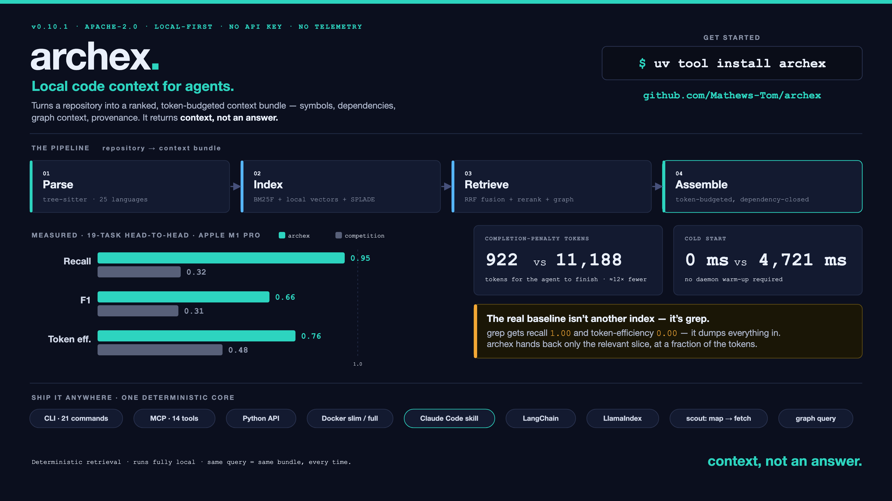

# archex

**Local code context for agents.**

archex turns a repository into a ranked, token-budgeted context bundle with symbols, dependencies, graph context, and provenance. It runs locally, uses deterministic retrieval and analysis, and does not require hosted inference or an API key.

[](https://github.com/Mathews-Tom/archex/actions/workflows/ci.yml)
[](https://pypi.org/project/archex/)
[](https://pypi.org/project/archex/)
[](LICENSE)
[](https://codecov.io/gh/Mathews-Tom/archex)

**Start:** [30-second quickstart](#30-second-quickstart) · [Claude Code / MCP](#mcp-and-claude-code) · [Measured results](docs/ARCHEX_VS_COCOINDEX.md)

**Quick links:** [Proof bar](#proof-bar) · [Fast paths](#fast-paths) · [Quickstart](#30-second-quickstart) · [What archex returns](#what-archex-returns) · [Use it your way](#use-it-your-way) · [Trust and operations](#trust-and-operations) · [Measured results](#measured-results) · [Installation details](#installation-details) · [Language support](#language-support) · [Development](#development)

<p align="center">
  <a href="assets/archex-explainer.mp4">
    
  </a>
</p>

<p align="center">
  <a href="assets/archex-explainer.mp4">Watch the explainer</a> ·
  <a href="assets/archex-infographic-landscape.svg">Open SVG infographic</a> ·
  <a href="docs/ARCHEX_VS_COCOINDEX.md">Read the measured comparison</a>
</p>

## Proof bar

| Local-first | Interfaces | Language coverage | Public comparison |
| --- | --- | --- | --- |
| No hosted inference, no API key for core/MCP/Docker slim | CLI, MCP, Python API, Docker, Claude Code skill | 25 declared language IDs with explicit `full` vs `chunk-only` tiers | C1 head-to-head: archex / `ccc` / raw grep-read on the same tasks |

## Fast paths

| If you are evaluating... | Start here | Why |
| --- | --- | --- |
| Agent workflows | `archex doctor`, then `archex scout "question" --budget 1000 --format json` | Checks local trust first, then returns a compact map plus exact fetch handles. |
| Claude Code or MCP | [MCP and Claude Code](#mcp-and-claude-code) | Stdio MCP server, optional warm `--watch`, and an in-repo skill that teaches doctor → scout → fetch. |
| Python applications | [Python API](#python-api) | Deterministic `query()`, `analyze()`, `compare()`, and retriever integrations. |
| Benchmark proof | [Measured results](#measured-results) and [archex vs. cocoindex-code](docs/ARCHEX_VS_COCOINDEX.md) | Same-task C1 report, retrieval gates, and default-strategy decisions. |
| Architecture understanding | [System Design](docs/SYSTEM_DESIGN.md) | Current pipeline, graph query, scout, language tiers, and distribution surfaces. |

## 30-second quickstart

```bash
uv tool install archex
archex doctor
archex query "How does authentication work?" --format xml
```

`archex doctor` reports whether the local index, grammar support, model cache, MCP registration, and `.archex/` state are healthy. Repo-local commands default to the current working directory. If the repo has not been initialized yet:

```bash
archex init
archex index
archex query "How does authentication work?" --format xml
```

## What archex returns

archex returns a **context bundle**, not an answer. The downstream agent or model still does the reasoning; archex decides which code, symbols, dependencies, and type context belong in the prompt.

```xml
<context query="How does authentication work?">
  <structural-context>
    <file-tree><![CDATA[
src/auth/
  middleware.py
  tokens.py
  models.py
    ]]></file-tree>
  </structural-context>
  <chunks>
    <chunk file="src/auth/middleware.py" lines="42-78" symbol="authenticate" score="0.9312" tokens="284">
      <imports><![CDATA[from auth.tokens import verify_jwt]]></imports>
      <code><![CDATA[
def authenticate(request: Request) -> User:
    token = extract_bearer(request)
    claims = verify_jwt(token)
    return load_user(claims.sub)
      ]]></code>
    </chunk>
  </chunks>
  <type-definitions>
    <type-def file="src/auth/models.py" symbol="User" lines="10-24"><![CDATA[
@dataclass
class User: ...
    ]]></type-def>
  </type-definitions>
  <dependencies>
    <internal>auth.tokens.verify_jwt</internal>
    <external>pyjwt</external>
  </dependencies>
</context>
```

The bundle carries ranked chunks, import context, referenced type definitions, dependency edges, token counts, and provenance. Use `--format json` or `--format markdown` when XML is not the right downstream envelope.

## Why archex is different

Agents usually explore repositories by opening one file, following imports, checking type definitions, and backtracking. That burns context before the real task starts. archex performs local retrieval and structural expansion first: BM25F, optional local vector/SPLADE signals, graph expansion with edge confidence, type-definition packing, and intent-routed token budgets.

```text
Repository → repo-local index → intent routing → retrieval → graph/type expansion → token-budgeted bundle → agent / MCP client
```

archex is a selection and assembly layer. Compression tools can shrink the final bundle later, but compressed irrelevant context is still irrelevant.

## Use it your way

### CLI

```bash
archex query "Where is cache invalidation handled?" --format xml
archex scout "How does authentication flow through this repo?" --budget 1000 --format json
archex graph export --output .archex/archgraph.json
archex graph neighbors src/auth/middleware.py --graph .archex/archgraph.json --format markdown
archex symbol 'symbol:src/auth/middleware.py::authenticate#function'
```

### MCP and Claude Code

Install the MCP extra and register the stdio server:

```bash
uv tool install "archex[mcp]"
```

```json
{
  "mcpServers": {
    "archex": { "command": "archex", "args": ["mcp"] }
  }
}
```

For warm local sessions, keep the MCP process alive and optionally watch the repo:

```bash
archex mcp --watch --watch-path .
```

The in-repo Claude Code skill lives at [`skills/archex/`](skills/archex/). Its `/archex` command runs `archex doctor`, initializes/indexes when needed, scouts first for broad questions, then fetches exact `symbol:` or `chunk:` handles before a larger bundle query.

### Python API

```python
from archex import query
from archex.models import RepoSource

bundle = query(
    RepoSource(local_path="."),
    "Where is database connection pooling implemented?",
)
print(bundle.to_prompt(format="xml"))
```

`analyze()` returns an `ArchProfile`; `compare()` returns deterministic cross-repo dimension comparisons. LangChain and LlamaIndex retrievers ship as optional extras.

### Docker

Two local-first images are built in CI:

```bash
# BM25-only, no torch
docker run --rm -v "$PWD:/workspace" -w /workspace ghcr.io/mathews-tom/archex:slim archex doctor

# Full local-embedding image with FastEmbed prewarmed
docker run --rm -v "$PWD:/workspace" -w /workspace ghcr.io/mathews-tom/archex:full archex query "Where is cache invalidation handled?" --strategy hybrid
```

Warm-container MCP pattern:

```bash
docker run -d --name archex-mcp -v "$PWD:/workspace" -w /workspace ghcr.io/mathews-tom/archex:slim sleep infinity
docker exec -i archex-mcp archex mcp
```

MCP client config for that container:

```json
{
  "mcpServers": {
    "archex": {
      "command": "docker",
      "args": ["exec", "-i", "archex-mcp", "archex", "mcp"]
    }
  }
}
```

The mounted repository owns `.archex/`, so indexes survive container restarts and stay out of source control.

## Trust and operations

| Surface | Contract |
| --- | --- |
| `archex doctor` | Text/JSON diagnostics for index health, staleness, local model cache presence, grammar availability by tier, MCP registration, and `.archex/` disk usage. |
| Repo-local `.archex/` | Generated state: settings, metadata, SQLite index, optional vectors, graph artifacts, dogfood history. Keep it uncommitted. |
| Freshness | Query and MCP paths can apply small working-tree deltas; `archex mcp --watch` keeps a warm process current when enabled. |
| Default strategy | `archex_query` remains the product default until a full evidence gate beats it on F1, recall, token efficiency, and p95. |
| Distribution | Core CLI, MCP, skill, slim Docker, and benchmark gates work without hosted inference or API keys. |

## Measured results

The public C1 harness runs the same external-repo tasks through archex, cocoindex-code (`ccc`), and a raw grep/read baseline. It records cold-start, warm latency, recall, precision, F1, token efficiency, and bundle-completion penalty tokens. See [archex vs. cocoindex-code](docs/ARCHEX_VS_COCOINDEX.md) for methodology and evidence sources.

| Lane | Recall | F1 | Token efficiency | Warm latency ms |
| --- | ---: | ---: | ---: | ---: |
| `archex` | 0.95 | 0.66 | 0.76 | 408 |
| `ccc` | 0.32 | 0.31 | 0.48 | 521 |
| `raw-grep/read` | 1.00 | 0.38 | 0.00 | 155 |

The local 35-task retrieval benchmark still governs default-strategy decisions. The accepted decision record keeps `archex_query` as the product default: [Retrieval Default Decisions](docs/RETRIEVAL_DEFAULT_DECISIONS.md) and [ADR-001](docs/adr/001-retrieval-default-evidence-gate.md).

## Advanced workflows

```bash
# Repo-local lifecycle
archex init
archex index
archex status --strict
archex doctor --format json

# Architecture and graph surfaces
archex analyze --format markdown
archex onboard
archex graph export --output .archex/archgraph.json
archex graph path src/archex/cli/query_cmd.py src/archex/serve/context.py --graph .archex/archgraph.json --format markdown
archex impact --changed-file src/archex/serve/context.py

# Benchmarks and gates
archex benchmark headtohead report --input .archex/headtohead --format markdown
archex benchmark gate --input .archex/e2e --baseline .archex/e2e-baseline --warn-latency-ms 3000
archex dogfood --all --baseline benchmarks/dogfood_baseline.json --format dogfood-delta
```

## Installation details

```bash
uv tool install archex                    # CLI, system-wide
uv add archex                             # project dependency

# Agent integrations
uv tool install "archex[mcp]"             # MCP server
uv add "archex[langchain]"                # LangChain retriever
uv add "archex[llamaindex]"               # LlamaIndex retriever
uv add "archex[lsap]"                     # LSP type enrichment

# Local retrieval extras
uv add "archex[vector]"                   # ONNX local embeddings
uv add "archex[vector-fast]"              # FastEmbed
uv add "archex[vector-torch]"             # sentence-transformers / torch
uv add "archex[splade]"                   # SPLADE sparse retrieval
uv add "archex[graph]"                    # Leiden graph clustering
# Core extras bundle: vector, graph, MCP, LangChain, LlamaIndex
uv add "archex[all]"
```

## Language support

| Tier | Languages | Extraction |
| --- | --- | --- |
| `full` | Python, JavaScript, TypeScript/TSX, Go, Rust, Java, Kotlin, C#, Swift | Symbols, imports, graph edges |
| `chunk-only` | C, C++, PHP, Ruby, Scala, Lua, Bash/Shell, SQL, HTML, CSS, YAML, TOML, JSON, Markdown, Solidity | AST chunking + retrieval; no symbol/import graph claim |
| `unknown` | any other text file | line-window chunks for BM25 visibility |

Need another language? Register an adapter via Python entry points. See [System Design](docs/SYSTEM_DESIGN.md) for the extension contract.

## What archex is not

- **Not a chatbot** — it emits context bundles; another agent or LLM does the explaining.
- **Not a hosted RAG service** — indexing and retrieval run locally unless you explicitly query a remote Git URL.
- **Not a vector database** — vector search is optional; BM25 and structural signals are first-class.
- **Not an LSP replacement** — use LSAP/LSP where compiler-backed type resolution matters; archex packages repository-scale context for agents.
- **Not a prompt template library** — output is structured retrieval evidence, not prompt prose.

## Development

```bash
git clone https://github.com/Mathews-Tom/archex.git
cd archex
uv sync --all-extras

uv run ruff check && uv run ruff format --check .
uv run pyright
uv run pytest
```

## Documentation map

Authority chain: README → [System Design](docs/SYSTEM_DESIGN.md) / [archex vs. cocoindex-code](docs/ARCHEX_VS_COCOINDEX.md) → `.docs/2026-06-12-unified-roadmap-session-prompts.md` → [Retrieval Default Decisions](docs/RETRIEVAL_DEFAULT_DECISIONS.md) / [ADR-001](docs/adr/001-retrieval-default-evidence-gate.md).

- [Why archex](docs/WHY_ARCHEX.md) — the agent token problem this solves
- [System Overview](docs/OVERVIEW.md) — product overview and boundaries
- [System Design](docs/SYSTEM_DESIGN.md) — shipped architecture, graph query, scout, language tiers, and distribution surfaces
- [archex vs. cocoindex-code](docs/ARCHEX_VS_COCOINDEX.md) — evidence-backed C1 comparison
- [Retrieval Default Decisions](docs/RETRIEVAL_DEFAULT_DECISIONS.md) — default-strategy evidence gate
- [Roadmap](docs/ROADMAP.md) — historical execution record

## License

Apache 2.0 — see [LICENSE](LICENSE).

## Star History

<a href="https://www.star-history.com/?repos=Mathews-Tom%2Farchex&type=date&legend=top-left">
 <picture>
   <source media="(prefers-color-scheme: dark)" srcset="https://api.star-history.com/chart?repos=Mathews-Tom/archex&type=date&theme=dark&legend=top-left" />
   <source media="(prefers-color-scheme: light)" srcset="https://api.star-history.com/chart?repos=Mathews-Tom/archex&type=date&legend=top-left" />
   
 </picture>
</a>
