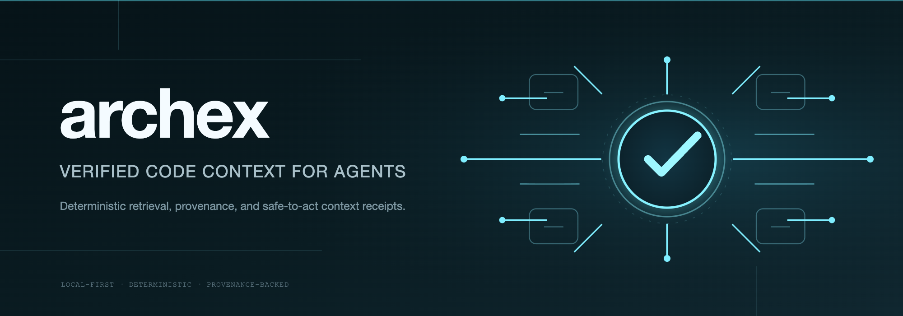

# archex

[](https://github.com/Mathews-Tom/archex/actions/workflows/ci.yml)
[](https://pypi.org/project/archex/)
[](https://pypi.org/project/archex/)
[](https://pypi.org/project/archex/)
[](https://github.com/Mathews-Tom/archex/actions/workflows/ci.yml)
[](https://github.com/Mathews-Tom/archex/actions/workflows/ci.yml)
[](#language-support)
[](#mcp-and-claude-code)
[](https://github.com/astral-sh/ruff)
[](https://github.com/microsoft/pyright)
[](LICENSE)

[](assets/archex-banner.svg)

---

**Verified local code context for agents.**

AI coding agents usually start by opening a file, following an import, checking a type definition, and backtracking through the repo until the context window is partly spent before the real task starts. archex does that retrieval and structural expansion up front and returns a ranked, token-budgeted context bundle plus a receipt that records what was included, what was skipped, and whether the bundle is complete enough to act on.

It runs locally, uses deterministic retrieval and analysis, and does not require hosted inference or an API key. The v0.16 line adds five full-tier language promotions (PHP, Ruby, Scala, C, C++), a new `structured` tier for markup/config languages (HTML, XML, YAML, Markdown, CSS) with a Maven POM dependency-graph plugin, portable index artifacts for team-shared bootstrap, and diff-scoped blast-radius analysis with per-symbol risk classification. The v0.17 line adds opt-in, non-blocking tool-call hooks across six clients (Claude Code, oh-my-pi, Pi, OpenCode, Codex CLI, Cursor) that augment `grep`/`glob`-shaped calls with archex results — or, where a client has no matching hook to augment, log a diagnostics-only trace instead of claiming a capability that isn't there. The v0.18 line slims the default `--format json` chunk output (unset/empty fields dropped, `--full` to restore) and adds an opt-in `--format toon` encoding for further token savings on top of that.

**Start:** [30-second quickstart](#30-second-quickstart) · [MCP and Claude Code](#mcp-and-claude-code) · [Python API](#python-api) · [Local metrics](docs/LOCAL_METRICS.md) · [Compatibility matrix](docs/CLIENT_COMPATIBILITY_MATRIX.md) · [Installation trust contract](docs/INSTALLATION_TRUST_CONTRACT.md) · [Security policy](SECURITY.md)

**Quick links:** [Proof bar](#proof-bar) · [Fast paths](#fast-paths) · [What archex returns](#what-archex-returns) · [Use it your way](#use-it-your-way) · [Trust and operations](#trust-and-operations) · [Measured results](#measured-results) · [Advanced workflows](#advanced-workflows) · [Installation details](#installation-details) · [Language support](#language-support) · [Development](#development) · [Documentation map](#documentation-map)

[](assets/archex-explainer.gif)

[Watch the explainer](assets/archex-explainer.mp4) · [Open banner SVG](assets/archex-banner.svg) · [Open infographic SVG](assets/archex-infographic-landscape.svg) · [Read the measured comparison](docs/ARCHEX_VS_COCOINDEX.md)

## Proof bar

| Safe-to-act signals | Surfaces | Language coverage | Public evidence |
| --- | --- | --- | --- |
| Query/scout receipts expose freshness, index revision, skipped candidates, omitted edges, completeness, and next action | CLI, MCP, Python API, Docker, Claude Code skill | 26 declared language IDs across `full`, `structured`, and `chunk-only` tiers | C1 public comparison, raw-ripgrep/read baseline, bundle-only evaluator lane, and TurboQuant A/B measurement with 7.07× mean vector `.npz` compression |

archex does not ask the downstream agent to trust ranking alone. Every query/scout receipt explains what was returned, what was skipped, whether freshness was current, and whether the bundle is complete enough to act on.

## Fast paths

| If you are evaluating... | Start here | Why |
| --- | --- | --- |
| Agent workflows | `archex doctor`, then `archex context "question"` | Checks local trust first, then returns a candidate map, exact fetch handles, selected code, relation paths, a route decision, and a receipt in one call. |
| Already using an agent that calls Grep/Glob | `archex install-client <client> --hooks` | Zero added context cost — augments existing tool calls instead of registering a new MCP tool surface. |
| Want the full tool surface (graph, impact, symbol lookup, etc.) | [MCP and Claude Code](#mcp-and-claude-code) | Stdio MCP server, optional warm `--watch`, additive top-level receipts. Registers 18 tool schemas that resend every turn regardless of use — heavier than hooks, richer than grep/glob augmentation. |
| Python applications | [Python API](#python-api) | Deterministic `query()`, `analyze()`, `compare()`, and receipt-bearing bundles. |
| Benchmark proof | [Measured results](#measured-results) and [archex vs. cocoindex-code](docs/ARCHEX_VS_COCOINDEX.md) | Same-task C1 report, raw-ripgrep/read baseline, bundle-only evaluator reports, required-file trust gates, and TurboQuant storage/recall evidence. |
| Installation and clients | [Compatibility matrix](docs/CLIENT_COMPATIBILITY_MATRIX.md) | Client bootstrap paths for Claude Code, Codex, Pi, OpenCode, Cursor, and oh-my-pi (`omp`); global/user scope by default, `--dry-run` previews. |

## 30-second quickstart

```bash
uv tool install archex
archex setup
archex context "How does authentication work?"
```

`archex context` is the documented primary agent path — one call returns a candidate map, exact fetch handles, selected code, relation paths, a route decision, and a receipt. The specialized `archex query`/`archex scout`/`archex symbol` commands remain fully supported for their narrower use cases:

```bash
archex query "How does authentication work?" --format xml
```

`archex setup` is the primary guided onboarding command. It initializes repo-local state, builds the first index, checks MCP runtime health, and offers to configure detected clients and agent guidance.

`archex doctor` reports whether the local index, grammar support, model cache, MCP registration, and `.archex/` state are healthy. Repo-local commands default to the current working directory.

For explicit repo initialization without the full guided setup:

```bash
archex init
archex query "How does authentication work?" --format xml
```

## What archex returns

archex returns a **context bundle plus receipt**, not an answer. The downstream agent or model still does the reasoning; archex decides which code, symbols, dependencies, and type context belong in the prompt, then records why that bundle is safe or incomplete.

```xml
<context query="How does authentication work?">
  <structural-context>
    <file-tree><![CDATA[
src/auth/
  middleware.py
  tokens.py
  models.py
    ]]></file-tree>
  </structural-context>
  <chunks>
    <chunk file="src/auth/middleware.py" lines="42-78" symbol="authenticate" score="0.9312" tokens="284">
      <imports><![CDATA[from auth.tokens import verify_jwt]]></imports>
      <code><![CDATA[
def authenticate(request: Request) -> User:
    token = extract_bearer(request)
    claims = verify_jwt(token)
    return load_user(claims.sub)
      ]]></code>
    </chunk>
  </chunks>
  <type-definitions>
    <type-def file="src/auth/models.py" symbol="User" lines="10-24"><![CDATA[
@dataclass
class User: ...
    ]]></type-def>
  </type-definitions>
  <dependencies>
    <internal>auth.tokens.verify_jwt</internal>
    <external>pyjwt</external>
  </dependencies>
</context>
```

The bundle carries ranked chunks, import context, referenced type definitions, dependency edges, token counts, and provenance. Use `--format json` or `--format markdown` when XML is not the right downstream envelope, or `--format toon` (optional `archex[toon]` extra) for a smaller-still encoding built on the same field selection. `json` and `toon` output omit unset/empty chunk fields by default — pass `--full` to restore every field.

Small receipt example:

```json
{
  "receipt": {
    "freshness": "clean",
    "index_revision": "3d8b0c…",
    "token_budget": { "requested": 12000, "consumed": 6132 },
    "returned_total": 12,
    "skipped_total": 23,
    "included_edges_total": 9,
    "omitted_edges_total": 17,
    "context_complete": "incomplete",
    "context_complete_reason": "dependency_frontier_cut",
    "recommended_next_action": "fetch_skipped_candidate",
    "returned_context": [
      {
        "handle": "chunk:src/auth/middleware.py::authenticate#function",
        "file_path": "src/auth/middleware.py",
        "start_line": 42,
        "end_line": 78,
        "score": 0.9312
      }
    ],
    "skipped_candidates": [
      { "file_path": "src/auth/session.py", "reason": "below_threshold" }
    ]
  }
}
```

Use [CONTEXT_RECEIPTS](docs/CONTEXT_RECEIPTS.md) for the full field contract.


## Why archex is different

Agents usually explore repositories by opening one file, following imports, checking type definitions, and backtracking. That burns context before the real task starts. Unlike a hosted RAG service, a vector database, or a chatbot, archex does not answer questions, host anything remotely, or require vector search to work — it performs local retrieval and structural expansion first: BM25F, optional local vector/SPLADE signals, graph expansion with edge confidence, type-definition packing, and intent-routed token budgets.

```text
Repository → repo-local index → intent routing → retrieval → graph/type expansion → token-budgeted bundle → agent / MCP client
```

archex is a selection and assembly layer. Compression tools can shrink the final bundle later, but compressed irrelevant context is still irrelevant. For the vector index itself, v0.13 enables 4-bit TurboQuant storage by default when vector retrieval is turned on: same measured recall/MRR on the current corpus, about seven times smaller vector artifacts, and self-describing compatibility with older unquantized `.npz` files.

## Use it your way

### CLI

```bash
archex context "Where is cache invalidation handled?"
archex query "Where is cache invalidation handled?" --format xml
archex scout "How does authentication flow through this repo?" --budget 1000 --format json
archex query "How does authentication work?" --format toon   # requires: uv add "archex[toon]"
archex index --quantize-vectors --quantize-bits 4 --allow-remote-code
archex graph export --output .archex/archgraph.json
archex graph neighbors src/auth/middleware.py --graph .archex/archgraph.json --format markdown
archex symbol 'symbol:src/auth/middleware.py::authenticate#function'
```

### MCP and Claude Code

Registers all 18 archex tools with a client; every tool's schema resends on every conversational turn regardless of use, since tool-calling APIs are stateless. That is real, measurable context cost — roughly 6,000 tokens for the full set, computed from the tool schemas in `src/archex/integrations/mcp.py`. If a client only needs grep/glob-shaped lookups, `archex install-client <client> --hooks` (documented further down this section) gets the same retrieval quality with zero added schema cost. Use MCP when the fuller surface — graph inspection, impact analysis, batch symbol lookup — is worth that fixed per-turn cost. The `context` tool is the same primary agent path as the CLI's `archex context`: query/intent/profile/filters/budgets/handles in, candidate map/fetch handles/selected code/relation paths/route/receipt/next action out.

Install the MCP extra and register the stdio server:

```bash
uv tool install "archex[mcp]"
```

```json
{
  "mcpServers": {
    "archex": { "command": "archex", "args": ["mcp"] }
  }
}
```

Install the client config (global/user scope by default; pass a SOURCE path or `--scope project` for a repo-local install). Add `--dry-run` to preview the exact target and config without writing:

```bash
archex install-client claude-code            # global, writes immediately
archex install-client claude-code --dry-run  # preview only, no changes
archex install-client claude-code . --scope project
```

For warm local sessions, keep the MCP process alive and optionally watch the repo:

```bash
archex mcp --watch --watch-path .
```

archex is a first-class `install-client` target for Claude Code, Codex, Cursor, OpenCode, Pi, and oh-my-pi (`omp` → `~/.omp/agent/mcp.json`). Registration alone is not enough: harnesses with on-demand tool discovery surface a registered server's tools only after the agent activates them, and agent guidance that names only the CLI never produces MCP calls. Append the ready-to-paste guidance prompt to a global or repo-specific agent file so agents reach for the MCP tools first:

```bash
archex install-client omp --agent-file ~/.omp/agent/AGENTS.md
```

`archex metrics` then reports a CLI-vs-MCP surface split so you can see whether agents actually route context through archex. The [compatibility matrix](docs/CLIENT_COMPATIBILITY_MATRIX.md) explains the registration → surfacing → invocation distinction.

The in-repo Claude Code skill lives at [`skills/archex/`](skills/archex/). Its `/archex` command runs `archex doctor`, initializes/indexes when needed, scouts first for broad questions, then fetches exact `symbol:` or `chunk:` handles before a larger bundle query.

Six of those clients also get an opt-in, non-blocking tool-call hook: `archex install-client <client> --hooks` (`--remove-hooks` to uninstall) wires `python -m archex.integrations.hook`'s lookup/timeout/freshness engine into the client's own hook mechanism. On Claude Code, oh-my-pi, Pi, and OpenCode it augments `grep`/`glob`-equivalent tool calls with archex symbol-search results (receipt-stamped, freshness-marked); Codex CLI and Cursor have no matching tool-call hook to attach that to, so they ship a diagnostics-only fallback that logs what would have been surfaced instead of injecting anything. Every one of the six degrades silently on a missing/stale index, a timeout (~500ms hard budget), or any internal error — none of them ever block a tool call, and none ever match `Read`/`beforeReadFile`. Full per-client contracts, confirmation-spike findings, and manual verification steps live in the [compatibility matrix](docs/CLIENT_COMPATIBILITY_MATRIX.md#claude-code-pretooluse-hook-opt-in).

Exact install, MCP, Docker, cache, uninstall, and trust semantics are documented in the [installation trust contract](docs/INSTALLATION_TRUST_CONTRACT.md). Client-specific config targets and bootstrap paths live in the [compatibility matrix](docs/CLIENT_COMPATIBILITY_MATRIX.md).

Local usage metrics are off by default. If a user explicitly enables them with `archex metrics enable`, `ARCHEX_USAGE_METRICS=on`, or the persisted metrics setting, archex writes a machine-local ledger at `~/.archex/usage.sqlite`. That ledger records anonymous counters only: tool name, category, token counts, file count, repo-local random ID, freshness, and index revision. It does not store query text, file paths, symbols, handles, rendered outputs, prompt bodies, remote URLs, org names, or repo names in event rows. `archex metrics summary` reports two labeled savings numbers: savings versus a full-file paste (`tokens_saved = max(full_file_tokens - returned, 0)`, where `full_file_tokens` is the true per-file token cost of the returned files, not an inflated chunk sum) and savings versus a realistic targeted read (the matched line ranges plus a small context window — the conservative counterfactual). Both baselines are derived from the index, so the metrics path re-reads no file and calls no model. Whole-repo avoided tokens are demoted below the savings lines and labeled an upper-bound/context figure, not savings.

Important boundary: archex ships with no telemetry by default. Optional local metrics are separate from telemetry, stay on the machine, and require explicit enablement. Detailed traces remain a second explicit opt-in on top of metrics enablement. The exact calculation rules, privacy boundary, and controls live in [LOCAL_METRICS](docs/LOCAL_METRICS.md).

`archex metrics` is the control surface:

```bash
archex metrics enable
archex metrics
archex metrics export --output usage.json
archex metrics delete --all
archex metrics trace enable
ARCHEX_USAGE_METRICS=on archex query "Where is auth handled?"
```

Detailed traces stay opt-in via `archex metrics trace enable` or `ARCHEX_USAGE_TRACE=on`. Traces remain local-only and still do not store source code or rendered outputs. Metrics code paths make no LLM calls, no hosted upload calls, and no background network calls in v1.
### Python API

```python
from archex import query
from archex.models import RepoSource

bundle = query(
    RepoSource(local_path="."),
    "Where is database connection pooling implemented?",
)
print(bundle.to_prompt(format="xml"))
```

`analyze()` returns an `ArchProfile`; `compare()` returns deterministic cross-repo dimension comparisons. LangChain and LlamaIndex retrievers ship as optional extras.

### Docker

Two local-first images are built in CI:

<details>
<summary>Docker and warm-container MCP examples</summary>

```bash
# BM25-only, no torch
docker run --rm -v "$PWD:/workspace" -w /workspace ghcr.io/mathews-tom/archex:slim archex doctor

# Full local-embedding image with FastEmbed runtime
docker run --rm -v "$PWD:/workspace" -w /workspace ghcr.io/mathews-tom/archex:full archex query "Where is cache invalidation handled?" --strategy hybrid
```

Warm-container MCP pattern:

```bash
docker run -d --name archex-mcp -v "$PWD:/workspace" -w /workspace ghcr.io/mathews-tom/archex:slim sleep infinity
docker exec -i archex-mcp archex mcp
```

MCP client config for that container:

```json
{
  "mcpServers": {
    "archex": {
      "command": "docker",
      "args": ["exec", "-i", "archex-mcp", "archex", "mcp"]
    }
  }
}
```

The mounted repository owns `.archex/`, so indexes survive container restarts and stay out of source control.
</details>

## Trust and operations

| Surface | Contract |
| --- | --- |
| Security policy | Supported versions, disclosure workflow, no-telemetry posture, secret-handling guidance, and model remote-code policy live in [SECURITY](SECURITY.md). |
| Context receipts | Field contract, freshness/completeness semantics, output surfaces, and benchmark linkage live in [CONTEXT_RECEIPTS](docs/CONTEXT_RECEIPTS.md). |
| Compatibility matrix | Tested vs unverified clients, exact config shapes, bootstrap commands, and verification steps live in [CLIENT_COMPATIBILITY_MATRIX](docs/CLIENT_COMPATIBILITY_MATRIX.md). |
| Installation trust contract | Exact CLI, MCP, Docker, skill, cache, network, freshness, benchmark, and uninstall semantics live in [INSTALLATION_TRUST_CONTRACT](docs/INSTALLATION_TRUST_CONTRACT.md). |
| `archex install-client` | Client config writer for Claude Code, Codex, Pi, OpenCode, Cursor, and oh-my-pi (`omp`). Global/user scope by default; `--dry-run` previews without writing. |
| `archex doctor` | Text/JSON diagnostics for index health, staleness, local model cache presence, grammar availability by tier, MCP registration, model security, and `.archex/` disk usage. |
| Repo-local `.archex/` | Generated state: settings, metadata, SQLite index, optional vectors, graph artifacts, dogfood history. Keep it uncommitted. |
| Local usage metrics | Calculation rules, privacy boundaries, default-off versus opt-in behavior, export/delete controls, and retention live in [LOCAL_METRICS](docs/LOCAL_METRICS.md). |
| `archex report status-card` | Opt-in, dimensioned documentation/release status summary: doc-link, ADR, and CODEOWNERS-style ownership evidence (each disabled unless its `documentation_evidence_providers` entry is configured) plus local CHANGELOG/CI-workflow evidence. Every dimension links to immutable local evidence; there is no composite score or letter grade, and the output is never written back into the repository automatically — paste it into your own README by hand if you want to publish it. |

## Measured results

The public C1 harness publishes the same external-repo comparison for archex, cocoindex-code (`ccc`), and a raw-ripgrep/read baseline. It records cold-start, warm latency, recall, precision, F1, token efficiency, required-file recall, missed-required-file rate, missed-required-task rate, all-required-present rate, receipt accuracy, and bundle-completion penalty tokens. The checked-in artifacts include those trust fields; receipt accuracy is `n/a` for the historical C1 run because those artifacts predate query receipt capture. Core retrieval benchmarks make no LLM calls.

See [archex vs. cocoindex-code](docs/ARCHEX_VS_COCOINDEX.md) for the current published comparison and [Retrieval Default Decisions](docs/RETRIEVAL_DEFAULT_DECISIONS.md) for the decision trail.

A broader competitive comparison is available with `archex benchmark headtohead competitive --input benchmarks/headtohead/results --format markdown`. It groups the same lanes by repo/task family and aggregate (no aggregate-only winner) and adds warm p50/p95 latency, region/line recall where labeled, compression ratio, and an operational table. The checked-in public artifact set now includes the benchmark-only archex candidate lanes (`archex_query_compressed`, `archex_query_efficiency_packed`) alongside `archex`, `ccc`, raw-ripgrep/read, and two Graphify follow-up lanes: `graphify_build_plus_query` (aggregate recall `0.70`, required-file recall `0.70`, cold-start `937 ms`, warm p50/p95 `165/184 ms`) and `graphify_query_warm` (aggregate recall `0.70`, required-file recall `0.70`, cold-start `0 ms`, warm p50/p95 `168/207 ms`). Graphify is reported as a graph / memory layer, not as a direct retrieval-equivalent winner, so build cost and warm-query cost stay separate. Headroom-style compression lanes appear when operator artifacts are present. No new public claim is made unless the corresponding checked-in artifacts exist under `benchmarks/headtohead/results/`.

Bundle-only evaluation is a separate opt-in lane: `archex benchmark bundle-eval --evaluator-command ...` gives a user-supplied local command only the rendered bundle and receipt JSON, then reports bundle-only success and files the evaluator still needed outside returned context. archex does not provide hosted evaluator calls, telemetry, credentials, or default network behavior for that lane.

Cross-tool token efficiency is measured offline with `archex benchmark cross-tool`: it compares the tokens archex spends to localize a task's required files against a naive grep/read agent (whole grep-hit files, or `+/-K` context windows around hits) at a fixed required-file recall, so no figure compares unequal recall. On the checked-in reference artifact ([`benchmarks/cross-tool-efficiency/cross-tool-comparison.json`](benchmarks/cross-tool-efficiency/cross-tool-comparison.json)), restricted to tasks where archex reaches 100% required-file recall, the token reduction versus the naive agent runs from 95.4% to 99.8% per corpus (for example external-localization: 13,247 vs 469,836 tokens, 97.2%). It measures how much cheaper archex localizes when it succeeds, not that it always succeeds. This is a benchmark-only number: it never enters the in-process ledger or `archex metrics summary`. The per-corpus table and method live in [LOCAL_METRICS](docs/LOCAL_METRICS.md).

TurboQuant evidence is measured separately with `archex_query_hybrid_quantized_4bit` against `archex_query_hybrid`: 35 tasks, 7.07× mean vector `.npz` compression, 6.98× minimum compression, recall Δ +0.000, MRR Δ +0.000, F1 Δ +0.000, required-file recall Δ +0.000, and mean query latency Δ +110 ms. That passed the default gate, so 4-bit TurboQuant is now the default storage mode for vector indexes.

| Lane | Recall | Required-file recall | Missed task rate | F1 | Token efficiency | Token efficiency after completion | Warm latency ms |
| --- | ---: | ---: | ---: | ---: | ---: | ---: | ---: |
| `archex` | 0.95 | 0.95 | 0.16 | 0.66 | 0.76 | 0.74 | 408 |
| `ccc` | 0.32 | 0.32 | 0.79 | 0.31 | 0.48 | 0.41 | 521 |
| `raw-ripgrep/read` | 1.00 | 1.00 | 0.00 | 0.05 | 0.00 | 0.00 | 773 |

### What this means for your workflow

- **Coverage stays close to raw search without paying raw-search token cost.** `raw-ripgrep/read` reaches `1.00` required-file recall, but it does so at `0.00` token efficiency. archex lands at `0.95` required-file recall with `0.76` token efficiency, so the returned bundle stays close to exhaustive file coverage without filling the prompt with every textual match.
- **Missed-task failures drop sharply versus `ccc`.** archex's missed task rate is `0.16`; `ccc` lands at `0.79`. In the published C1 run, that is the difference between usually returning the files an agent needs and often requiring a second pass before the task can finish.
- **Vector storage got much smaller without a measured retrieval-quality change.** The published 4-bit TurboQuant run reports `7.07×` mean vector `.npz` compression (`6.98×` minimum) with recall Δ `+0.000`, MRR Δ `+0.000`, and F1 Δ `+0.000`, so local vector indexes take far less disk without a measured quality regression in that benchmark.
- **`--format toon` trims the bundle further, on request.** `--format json`/`--format scout json` already drop unset/empty chunk fields by default (`--full` restores them); `--format toon` (optional `archex[toon]` extra) measures ~17% smaller than that default JSON output on the representative bundle in `tests/serve/test_renderers.py::test_toon_smaller_than_json_for_realistic_bundle`. Both are opt-in — the CLI's default format stays `xml`, which was already minimal before either change.

## Advanced workflows

```bash
# Repo-local lifecycle
archex init
archex index
archex index --export-artifact .archex/index.archexidx
archex init --from-artifact .archex/index.archexidx
archex status --strict
archex doctor --format json

# Architecture and graph surfaces
archex analyze --format markdown
archex onboard
archex graph export --output .archex/archgraph.json
archex graph path src/archex/cli/query_cmd.py src/archex/serve/context.py --graph .archex/archgraph.json --format markdown
archex impact --changed-file src/archex/serve/context.py
archex impact --diff HEAD~1

# Diff review — one versioned AnalysisArtifactV1, source-redacted by construction
archex report diff --base origin/main --format json
archex report diff --base origin/main --format markdown
archex report diff --base origin/main --format html > report.html
archex report delta --base origin/main --format markdown
archex report status-card --format markdown  # M9, opt-in: dimensioned doc/ADR/ownership + release evidence, disabled unless configured

# Benchmarks and gates
archex benchmark headtohead report --input .archex/headtohead --format markdown
archex benchmark run --strategy archex_query_hybrid_quantized_4bit --output .archex/e2e-quantized --allow-remote-code
archex benchmark report --input .archex/e2e-quantized --baseline .archex/e2e-baseline --format markdown
archex benchmark gate --input .archex/e2e --baseline .archex/e2e-baseline --warn-latency-ms 3000
archex benchmark bundle-eval --tasks-dir benchmarks/tasks --evaluator-command ./local-evaluator
archex dogfood --all --baseline benchmarks/dogfood_baseline.json --format dogfood-delta
```

## Installation details

```bash
uv tool install archex                    # CLI, system-wide
uv add archex                             # project dependency
```

<details>
<summary>Optional extras and integrations</summary>

```bash
# Agent integrations
uv tool install "archex[mcp]"             # MCP server
uv add "archex[langchain]"                # LangChain retriever
uv add "archex[llamaindex]"               # LlamaIndex retriever
uv add "archex[lsap]"                     # LSP type enrichment
uv add "archex[toon]"                     # TOON output format (token-lean encoding)

# Local retrieval extras
uv add "archex[vector-fast]"              # FastEmbed (ONNX-backed, ~50MB)
uv add "archex[vector-torch]"             # sentence-transformers / torch
uv add "archex[splade]"                   # SPLADE sparse retrieval
uv add "archex[graph]"                    # Leiden graph clustering
# Bundles every extra: vector-fast, graph, vector-torch, splade, mcp, langchain, llamaindex, lsap, toon
uv add "archex[all]"
```

</details>

For the full trust contract, including exact MCP JSON, Docker commands, cache locations, network behavior, and uninstall steps, see [Installation and Trust Contract](docs/INSTALLATION_TRUST_CONTRACT.md).

## Language support

| Tier | Languages | Extraction |
| --- | --- | --- |
| `full` | Python, JavaScript, TypeScript/TSX, Go, Rust, Java, Kotlin, C#, Swift, PHP, Ruby, Scala, C, C++ | Symbols, imports, graph edges |
| `structured` | HTML, XML, YAML, Markdown, CSS | Outline + native cross-file reference edges (script/link/img/a for HTML; anchors/aliases for YAML; links/section-anchors for Markdown; `@import`/`url()` for CSS); no programming-symbol claim |
| `chunk-only` | Lua, Bash/Shell, SQL, TOML, JSON, Solidity | AST chunking + retrieval; no symbol/import graph claim |
| `unknown` | any other text file | line-window chunks for BM25 visibility |

Need another language? Register an adapter via Python entry points. See [System Design](docs/SYSTEM_DESIGN.md) for the extension contract.

## What archex is not

- **Not a chatbot** — it emits context bundles; another agent or LLM does the explaining.
- **Not a hosted RAG service** — indexing and retrieval run locally unless you explicitly query a remote Git URL.
- **Not a vector database** — vector search is optional; BM25 and structural signals are first-class.
- **Not an LSP replacement** — use LSAP/LSP where compiler-backed type resolution matters; archex packages repository-scale context for agents.
- **Not a prompt template library** — output is structured retrieval evidence, not prompt prose.
- **Not a multimodal knowledge-graph builder** — no LLM-driven concept extraction over PDFs, images, or notes, and no persistent cross-session graph artifact; archex indexes source code deterministically to assemble token-budgeted retrieval context, not a browsable knowledge base.

## Development

```bash
git clone https://github.com/Mathews-Tom/archex.git
cd archex
uv sync --all-extras

uv run ruff check && uv run ruff format --check .
uv run pyright
uv run pytest
```

## Documentation map

Authority chain: README → [System Design](docs/SYSTEM_DESIGN.md) / [archex vs. cocoindex-code](docs/ARCHEX_VS_COCOINDEX.md) → [Roadmap completion record](docs/ROADMAP.md#2026-unified-roadmap-completion) → [Retrieval Default Decisions](docs/RETRIEVAL_DEFAULT_DECISIONS.md).

- [Why archex](docs/WHY_ARCHEX.md) — the agent token problem this solves
- [System Overview](docs/OVERVIEW.md) — current product overview and boundaries
- [System Design](docs/SYSTEM_DESIGN.md) — shipped architecture, graph query, scout, language tiers, and distribution surfaces
- [archex vs. cocoindex-code](docs/ARCHEX_VS_COCOINDEX.md) — evidence-backed C1 comparison
- [Retrieval Default Decisions](docs/RETRIEVAL_DEFAULT_DECISIONS.md) — default-strategy and TurboQuant evidence gates
- [Context Receipts](docs/CONTEXT_RECEIPTS.md) — receipt field contract and safe-to-act semantics
- [Local Metrics](docs/LOCAL_METRICS.md) — token-savings math, privacy boundary, and default-off versus opt-in behavior
- [Portable Index Artifact](docs/PORTABLE_INDEX_ARTIFACT.md) — export/import format, compression, staleness fallback, and `.gitattributes` handling for team-shared index bootstrap
- [Language Promotion Gate](docs/LANGUAGE_PROMOTION_GATE.md) — the recall/ranking-stability regression gate every language-tier promotion runs against

## License

Apache 2.0 — see [LICENSE](LICENSE).

## Star History

[](https://www.star-history.com/?repos=Mathews-Tom%2Farchex&type=date&legend=top-left)
