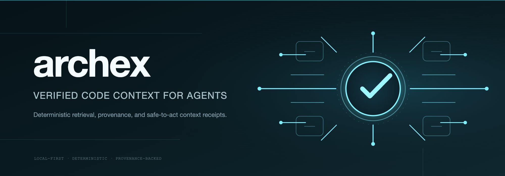

# archex

[](https://github.com/Mathews-Tom/archex/actions/workflows/ci.yml)
[](https://pypi.org/project/archex/)
[](https://pypi.org/project/archex/)
[](https://pypi.org/project/archex/)
[](https://github.com/Mathews-Tom/archex/actions/workflows/ci.yml)
[](https://github.com/Mathews-Tom/archex/actions/workflows/ci.yml)
[](#language-support)
[](#mcp-and-claude-code)
[](https://github.com/astral-sh/ruff)
[](https://github.com/microsoft/pyright)
[](LICENSE)

[](assets/archex-banner.svg)

---

**Verified local code context for agents.**

Coding agents already grep. archex annotates the agent's own search results: after a `grep`, `glob`, or shell `rg`, it appends one line per indexed code unit the hits fall in (name, kind, line span, importers), and leaves the result itself untouched. That runs on omp, Pi, OpenCode, Claude Code, and Codex through opt-in hooks (Cursor gets a diagnostics-only fallback), with the CLI and MCP server available when an agent needs to ask for context explicitly. It is local and deterministic, needs no hosted inference or API key, and fails open: a stale index, an error, or a call past the 0.5 s budget adds nothing. See [Surfaces](#surfaces) for the three ways in, in order of preference.

```bash
uv tool install archex
archex init                                   # in your repository; builds the index the hook reads
archex install-client claude-code --hooks     # or: omp, pi, opencode, codex
```

This is the output of `archex annotate` on this repository's own source, after `rg -n 'TIMEOUT_SECONDS' src/archex` (37 hit lines; trimmed here, the annotation was computed from all of them):

```text
$ rg -n 'TIMEOUT_SECONDS' src/archex
src/archex/benchmark/strategies.py:583:_RIPGREP_TIMEOUT_SECONDS = 30
src/archex/benchmark/strategies.py:623:                timeout=_RIPGREP_TIMEOUT_SECONDS,
src/archex/benchmark/strategies.py:627:                f"raw_ripgrep timed out after {_RIPGREP_TIMEOUT_SECONDS}s for keyword {keyword!r}"
src/archex/benchmark/strategies.py:696:            "timeout_seconds": str(_RIPGREP_TIMEOUT_SECONDS),
... [33 more hit lines elided] ...

[archex receipt] index_revision=f7d01aba5224 units=16
[archex] src/archex/benchmark/strategies.py module-level · units 118 · importers 33
[archex] src/archex/benchmark/strategies.py::run_raw_ripgrep function L586-699 · importers 33
[archex] src/archex/client_setup.py module-level · units 91 · importers 12
[archex] src/archex/client_setup.py::_render_codex_hook_block function L1485-1502 · importers 12
[archex] src/archex/integrations/diagnostics.py module-level · units 4 · importers 11
[archex] src/archex/integrations/diagnostics.py::hook_timeout_seconds function L22-32 · importers 11
[archex] src/archex/integrations/post_tool_use_annotate.py module-level · units 7 · importers 2
[archex] src/archex/post_edit/state.py module-level · units 14 · importers 3
[archex] src/archex/post_edit/state.py::_state_lock function L312-318 · importers 3
[archex] src/archex/post_edit/impact.py module-level · units 10 · importers 3
[archex] +6 more units
```

The first block is ripgrep's output, the second is what archex appends, exactly as printed. Capabilities beyond hooks: 26 declared language IDs across `full`, `structured`, and `chunk-only` tiers; portable index artifacts for team-shared bootstrap; diff-scoped blast-radius analysis; and a receipt-bearing `archex context` bundle. See the [changelog](CHANGELOG.md) for per-release detail, and [What we refuse to claim](#what-we-refuse-to-claim) for what none of this proves.

**Start:** [30-second quickstart](#30-second-quickstart) · [MCP and Claude Code](#mcp-and-claude-code) · [Python API](#python-api) · [Local metrics](docs/LOCAL_METRICS.md) · [Compatibility matrix](docs/CLIENT_COMPATIBILITY_MATRIX.md) · [Installation trust contract](docs/INSTALLATION_TRUST_CONTRACT.md) · [Security policy](SECURITY.md)

**Quick links:** [Proof bar](#proof-bar) · [Fast paths](#fast-paths) · [What archex returns](#what-archex-returns) · [Use it your way](#use-it-your-way) · [Trust and operations](#trust-and-operations) · [Measured results](#measured-results) · [Advanced workflows](#advanced-workflows) · [Installation details](#installation-details) · [Language support](#language-support) · [What we refuse to claim](#what-we-refuse-to-claim) · [Verify the claims above](#verify-the-claims-above) · [Development](#development) · [Documentation map](#documentation-map)

[](assets/archex-explainer.gif)

[Watch the explainer](assets/archex-explainer.mp4) · [Open banner SVG](assets/archex-banner.svg) · [Open infographic SVG](assets/archex-infographic-landscape.svg) · [Read the measured comparison](docs/ARCHEX_VS_COCOINDEX.md)

## Proof bar

| Safe-to-act signals | Surfaces | Language coverage | Public evidence |
| --- | --- | --- | --- |
| Query/scout receipts expose freshness, index revision, skipped candidates, omitted edges, completeness, and next action | CLI, MCP, Python API, Docker, Claude Code skill, search-annotation hooks (omp, Pi, OpenCode, Claude Code, Codex) | 26 declared language IDs across `full`, `structured`, and `chunk-only` tiers | C1 public comparison, raw-ripgrep/read baseline, bundle-only evaluator lane, and TurboQuant A/B measurement with 7.07× mean vector `.npz` compression |

archex does not ask the downstream agent to trust ranking alone. Every query/scout receipt explains what was returned, what was skipped, whether freshness was current, and whether the bundle is complete enough to act on.

**External replication.** archex's replication gate did not reproduce a published win: [RLCoder](benchmarks/evidence/s0-rlcoder-replication.json) records `fail` because its reproduced delta fell below the pre-registered band, while [cAST](benchmarks/evidence/s0-cast-replication.json) records `unrunnable` because its released artifact lacks the evaluation setup.

## Fast paths

| If you are evaluating... | Start here | Why |
| --- | --- | --- |
| Agent workflows | `archex doctor`, then `archex context "question"` | Checks local trust first, then returns a candidate map, exact fetch handles, selected code, relation paths, a route decision, and a receipt in one call. |
| Already using an agent that searches with grep/glob | `archex install-client <host> --hooks` (`omp`, `pi`, `opencode`, `claude-code`, `codex`) | No new tool for the agent to choose: annotates the agent's own search results with the code units they hit, capped at about 300 tokens per call, and leaves the results themselves untouched. See [Surfaces](#surfaces). |
| Want the full tool surface (graph, impact, symbol lookup, session records, etc.) | [MCP and Claude Code](#mcp-and-claude-code) | Stdio MCP server, optional warm `--watch`, additive top-level receipts. Starts with two retrieval schemas and exposes 20 after the first retrieval — heavier than hooks, richer than grep/glob augmentation. |
| Python applications | [Python API](#python-api) | Deterministic `query()`, `analyze()`, `compare()`, and receipt-bearing bundles. |
| Benchmark proof | [Measured results](#measured-results) and [archex vs. cocoindex-code](docs/ARCHEX_VS_COCOINDEX.md) | Same-task C1 report, raw-ripgrep/read baseline, bundle-only evaluator reports, required-file trust gates, and TurboQuant storage/recall evidence. |
| Installation and clients | [Compatibility matrix](docs/CLIENT_COMPATIBILITY_MATRIX.md) | Client bootstrap paths for Claude Code, Codex, Pi, OpenCode, Cursor, and oh-my-pi (`omp`); global/user scope by default, `--dry-run` previews. |

## 30-second quickstart

```bash
uv tool install archex
archex setup
archex context "How does authentication work?"
```

`archex context` is the documented primary agent path — one call returns a candidate map, exact fetch handles, selected code, relation paths, a route decision, and a receipt. The specialized `archex query`/`archex scout`/`archex symbol` commands remain fully supported for their narrower use cases:

```bash
archex query "How does authentication work?" --format xml
```

`archex setup` is the primary guided onboarding command. It initializes repo-local state, builds the first index, checks MCP runtime health, and offers to configure detected clients and agent guidance.

`archex doctor` reports whether the local index, grammar support, model cache, MCP registration, and `.archex/` state are healthy. Repo-local commands default to the current working directory.

For explicit repo initialization without the full guided setup:

```bash
archex init
archex query "How does authentication work?" --format xml
```

## What archex returns

archex returns a **context bundle plus receipt**, not an answer. The downstream agent or model still does the reasoning; archex decides which code, symbols, dependencies, and type context belong in the prompt, then records why that bundle is safe or incomplete.

```xml
<context query="How does authentication work?">
  <structural-context>
    <file-tree><![CDATA[
src/auth/
  middleware.py
  tokens.py
  models.py
    ]]></file-tree>
  </structural-context>
  <chunks>
    <chunk file="src/auth/middleware.py" lines="42-78" symbol="authenticate" score="0.9312" tokens="284">
      <imports><![CDATA[from auth.tokens import verify_jwt]]></imports>
      <code><![CDATA[
def authenticate(request: Request) -> User:
    token = extract_bearer(request)
    claims = verify_jwt(token)
    return load_user(claims.sub)
      ]]></code>
    </chunk>
  </chunks>
  <type-definitions>
    <type-def file="src/auth/models.py" symbol="User" lines="10-24"><![CDATA[
@dataclass
class User: ...
    ]]></type-def>
  </type-definitions>
  <dependencies>
    <internal>auth.tokens.verify_jwt</internal>
    <external>pyjwt</external>
  </dependencies>
</context>
```

The bundle carries ranked chunks, import context, referenced type definitions, dependency edges, token counts, and provenance. Use `--format json` or `--format markdown` when XML is not the right downstream envelope, or `--format toon` (optional `archex[toon]` extra) for a smaller-still encoding built on the same field selection. `json` and `toon` output omit unset/empty chunk fields by default — pass `--full` to restore every field.

Small receipt example:

```json
{
  "receipt": {
    "freshness": "clean",
    "index_revision": "3d8b0c…",
    "token_budget": { "requested": 12000, "consumed": 6132 },
    "query_terms_matched": ["authentication"],
    "query_terms_unmatched": [],
    "returned_total": 12,
    "skipped_total": 23,
    "included_edges_total": 9,
    "omitted_edges_total": 17,
    "context_complete": "incomplete",
    "context_complete_reason": "dependency_frontier_cut",
    "recommended_next_action": "fetch_skipped_candidate",
    "returned_context": [
      {
        "handle": "chunk:src/auth/middleware.py::authenticate#function",
        "file_path": "src/auth/middleware.py",
        "start_line": 42,
        "end_line": 78,
        "score": 0.9312
      }
    ],
    "skipped_candidates": [
      { "file_path": "src/auth/session.py", "reason": "below_threshold" }
    ]
  }
}
```

Use [CONTEXT_RECEIPTS](docs/CONTEXT_RECEIPTS.md) for the full field contract.


## Why archex is different

Agents usually explore repositories by opening one file, following imports, checking type definitions, and backtracking. That burns context before the real task starts. Unlike a hosted RAG service, a vector database, or a chatbot, archex does not answer questions, host anything remotely, or require vector search to work — it performs local retrieval and structural expansion first: BM25F, optional local vector/SPLADE signals, graph expansion with edge confidence, type-definition packing, and intent-routed token budgets.

```text
Repository → repo-local index → intent routing → retrieval → graph/type expansion → token-budgeted bundle → agent / MCP client
```

archex is a selection and assembly layer. Compression tools can shrink the final bundle later, but compressed irrelevant context is still irrelevant. For the vector index itself, v0.13 enables 4-bit TurboQuant storage by default when vector retrieval is turned on: same measured recall/MRR on the current corpus, about seven times smaller vector artifacts, and self-describing compatibility with older unquantized `.npz` files.

## Use it your way

### Surfaces

archex reaches an agent three ways. Prefer them in this order:

1. **Hook.** `archex install-client <host> --hooks` for `omp`, `pi`, `opencode`, `claude-code`, or `codex` annotates the agent's own search results — `grep`/`glob`/`find` tools and shell `rg`, `grep`/`egrep`/`fgrep`, `ugrep`, `git grep`, and path listers (`find`, `bfs`, `fd`, `rg --files`, `git ls-files`) — with one line per code unit the hits fall in (name, kind, span, importers), appended after the unchanged result. The agent does not have to decide to use archex. Cursor has no matching tool-call hook and gets a diagnostics-only fallback that injects nothing.
2. **CLI.** `archex scout` then `archex symbol` for location and structure questions, `archex impact` before changing a widely imported file, `archex query` for a bundle. Any host with a shell can run it; the agent must choose to.
3. **MCP.** `archex mcp`, for clients without a shell. It carries a per-request tool-schema cost.

Exact strings and "every occurrence" questions stay with grep. Contracts for each surface live in the [compatibility matrix](docs/CLIENT_COMPATIBILITY_MATRIX.md).

### CLI

```bash
archex context "Where is cache invalidation handled?"
archex query "Where is cache invalidation handled?" --format xml
archex scout "How does authentication flow through this repo?" --budget 1000 --format json
archex query "How does authentication work?" --format toon   # requires: uv add "archex[toon]"
archex index --quantize-vectors --quantize-bits 4 --allow-remote-code
archex graph export --output .archex/archgraph.json
archex graph neighbors src/auth/middleware.py --graph .archex/archgraph.json --format markdown
archex symbol 'symbol:src/auth/middleware.py::authenticate#function'
archex session record decision "Keep the auth boundary explicit."
archex session prime --budget 512 --format markdown
```

### MCP and Claude Code

Fresh MCP sessions advertise two retrieval schemas (765 measured tokens). After the first retrieval, the server exposes all 20 archex tools (4,272 measured tokens), including explicit project-session ledger operations. Tool-calling APIs are stateless, so a client receives the surface it has reached on every following turn. `uv run archex mcp-schema-size --format json` reports both figures from the schemas in `src/archex/integrations/mcp.py`. Hosts with a shell have the hook and the CLI first (see [Surfaces](#surfaces)); neither adds a tool schema. Use MCP when the client cannot run the CLI, or when the fuller surface — graph inspection, impact analysis, batch symbol lookup, or session continuity — is worth that post-retrieval cost. The `context` tool is the same primary agent path as the CLI's `archex context`: query/intent/profile/filters/budgets/handles in, candidate map/fetch handles/selected code/relation paths/route/receipt out. The `session` tool is explicit-only: it can record, list, invalidate, delete, or render a fresh-index bounded primer; it never records prompts, transcripts, inferred facts, or arbitrary tool output.

Install the MCP extra and register the stdio server:

```bash
uv tool install "archex[mcp]"
```

```json
{
  "mcpServers": {
    "archex": { "command": "archex", "args": ["mcp"] }
  }
}
```

Install the client config (global/user scope by default; pass a SOURCE path or `--scope project` for a repo-local install). Add `--dry-run` to preview the exact target and config without writing:

```bash
archex install-client claude-code            # global, writes immediately
archex install-client claude-code --dry-run  # preview only, no changes
archex install-client claude-code . --scope project
```

For warm local sessions, keep the MCP process alive and optionally watch the repo:

```bash
archex mcp --watch --watch-path .
```

archex is a first-class `install-client` target for Claude Code, Codex, Cursor, OpenCode, Pi, and oh-my-pi (`omp` → `~/.omp/agent/mcp.json`). Registration alone is not enough: harnesses with on-demand tool discovery surface a registered server's tools only after the agent activates them, and agent guidance that names only the CLI never produces MCP calls. Append the ready-to-paste guidance prompt to a global or repo-specific agent file so agents reach for the MCP tools first:

```bash
archex install-client omp --agent-file ~/.omp/agent/AGENTS.md
```

`archex metrics` then reports a CLI-vs-MCP surface split so you can see whether agents actually route context through archex. The [compatibility matrix](docs/CLIENT_COMPATIBILITY_MATRIX.md) explains the registration → surfacing → invocation distinction.

The in-repo Claude Code skill lives at [`skills/archex/`](skills/archex/). Its `/archex` command runs `archex doctor`, initializes/indexes when needed, scouts first for broad questions, then fetches exact `symbol:` or `chunk:` handles before a larger bundle query.

Six of those clients also get an opt-in, non-blocking tool-call hook: `archex install-client <client> --hooks` (`--remove-hooks` to uninstall). On oh-my-pi and Pi it annotates the agent's own `grep`/`glob`/`find` and bash `rg`/`grep`/`git grep` results: `archex annotate` maps each hit to its enclosing indexed code unit and appends one fact line per unit (name, kind, span, importers), leaving the original result byte-for-byte intact and logging every call to `~/.archex/annotation-ledger.jsonl`. On Claude Code the same annotation comes from a `PostToolUse` hook on `Bash|Grep|Glob` (`python -m archex.integrations.claude_code_annotate_hook`): it returns the fact lines as `additionalContext` next to the unchanged tool result, writes one ledger line per search call (with `host: claude-code` and the `tool_use_id`), and `install-client claude-code --hooks` replaces the retired `PreToolUse` pattern search that older versions installed. On Codex CLI a `PostToolUse` hook on the shell tool (`python -m archex.integrations.codex_annotate_hook`) does the same for shell `rg`/`grep`/`git grep` searches: the fact lines go out as `additionalContext`, which Codex records as a developer message beside the unchanged command output, one ledger line is written per search call (`host: codex`), and `install-client codex --hooks` replaces the retired diagnostics-only `PreToolUse` block; Codex 0.153.4 runs a config-file hook only once you have trusted it (`/hooks`). On OpenCode a `tool.execute.after` plugin (`.opencode/plugins/archex-hook.ts`) annotates the native `grep`, `glob`, and `bash` search calls: it appends the same fact lines after the tool's own text, which stays a byte-for-byte prefix, writes one ledger line per search call (with `host: opencode` and OpenCode's `callID`), and replaces the retired pattern-based symbol search; MCP-routed calls are never touched. Cursor has no matching tool-call hook to attach that to, so it ships a diagnostics-only fallback that logs what would have been surfaced instead of injecting anything. Every one of the six degrades silently on a missing/stale index, a timeout (~500ms hard budget), or any internal error — none of them ever block a tool call, and none ever match `Read`/`beforeReadFile`. Full per-client contracts, confirmation-spike findings, and manual verification steps live in the [compatibility matrix](docs/CLIENT_COMPATIBILITY_MATRIX.md#claude-code-posttooluse-search-annotation-hook-opt-in).

Exact install, MCP, Docker, cache, uninstall, and trust semantics are documented in the [installation trust contract](docs/INSTALLATION_TRUST_CONTRACT.md). Client-specific config targets and bootstrap paths live in the [compatibility matrix](docs/CLIENT_COMPATIBILITY_MATRIX.md).

Local usage metrics are off by default. If a user explicitly enables them with `archex metrics enable`, `ARCHEX_USAGE_METRICS=on`, or the persisted metrics setting, archex writes a machine-local ledger at `~/.archex/usage.sqlite`. That ledger records anonymous counters only: tool name, category, token counts, file count, repo-local random ID, freshness, and index revision. It does not store query text, file paths, symbols, handles, rendered outputs, prompt bodies, remote URLs, org names, or repo names in event rows. `archex metrics summary` reports two labeled savings numbers, and the headline one is **savings versus a realistic targeted read** (`savings_pct_vs_targeted_read`): the matched line ranges plus a small context window, which is what an agent that reads `grep` line numbers before opening a file actually pays. The second number, savings versus a full-file paste (`tokens_saved = max(full_file_tokens - returned, 0)`), is a compression figure against a naive whole-file paste and is systematically larger — on a representative single-query ledger row from this repository, 14.9% versus targeted read against 90.1% versus full-file paste. Quote the targeted-read number. Both baselines are derived from the index, so the metrics path re-reads no file and calls no model. Targeted-read tokens are recorded only where returned chunks carry line spans (`query`); `scout`'s file-only results record no targeted-read baseline, so a scout-only ledger shows `Savings vs targeted: 0.0%` — that is an absent baseline, not a measured zero. Whole-repo avoided tokens are demoted below the savings lines and labeled an upper-bound/context figure, not savings.

Important boundary: archex ships with no telemetry by default. Optional local metrics are separate from telemetry, stay on the machine, and require explicit enablement. Detailed traces remain a second explicit opt-in on top of metrics enablement. The exact calculation rules, privacy boundary, and controls live in [LOCAL_METRICS](docs/LOCAL_METRICS.md).

`archex metrics` is the control surface:

```bash
archex metrics enable
archex metrics
archex metrics export --output usage.json
archex metrics delete --all
archex metrics trace enable
ARCHEX_USAGE_METRICS=on archex query "Where is auth handled?"
```

Detailed traces stay opt-in via `archex metrics trace enable` or `ARCHEX_USAGE_TRACE=on`. Traces remain local-only and still do not store source code or rendered outputs. Metrics code paths make no LLM calls, no hosted upload calls, and no background network calls in v1.
### Python API

```python
from archex import query
from archex.models import RepoSource

bundle = query(
    RepoSource(local_path="."),
    "Where is database connection pooling implemented?",
)
print(bundle.to_prompt(format="xml"))
```

`analyze()` returns an `ArchProfile`; `compare()` returns deterministic cross-repo dimension comparisons. LangChain and LlamaIndex retrievers ship as optional extras.

### Docker

Two local-first images are built in CI:

<details>
<summary>Docker and warm-container MCP examples</summary>

```bash
# BM25-only, no torch
docker run --rm -v "$PWD:/workspace" -w /workspace ghcr.io/mathews-tom/archex:slim archex doctor

# Full local-embedding image with FastEmbed runtime
docker run --rm -v "$PWD:/workspace" -w /workspace ghcr.io/mathews-tom/archex:full archex query "Where is cache invalidation handled?" --strategy hybrid
```

Warm-container MCP pattern:

```bash
docker run -d --name archex-mcp -v "$PWD:/workspace" -w /workspace ghcr.io/mathews-tom/archex:slim sleep infinity
docker exec -i archex-mcp archex mcp
```

MCP client config for that container:

```json
{
  "mcpServers": {
    "archex": {
      "command": "docker",
      "args": ["exec", "-i", "archex-mcp", "archex", "mcp"]
    }
  }
}
```

The mounted repository owns `.archex/`, so indexes survive container restarts and stay out of source control.
</details>

## Trust and operations

| Surface | Contract |
| --- | --- |
| Security policy | Supported versions, disclosure workflow, no-telemetry posture, secret-handling guidance, and model remote-code policy live in [SECURITY](SECURITY.md). |
| Context receipts | Field contract, freshness/completeness semantics, output surfaces, and benchmark linkage live in [CONTEXT_RECEIPTS](docs/CONTEXT_RECEIPTS.md). |
| Compatibility matrix | Tested vs unverified clients, exact config shapes, bootstrap commands, and verification steps live in [CLIENT_COMPATIBILITY_MATRIX](docs/CLIENT_COMPATIBILITY_MATRIX.md). |
| Installation trust contract | Exact CLI, MCP, Docker, skill, cache, network, freshness, benchmark, and uninstall semantics live in [INSTALLATION_TRUST_CONTRACT](docs/INSTALLATION_TRUST_CONTRACT.md). |
| `archex install-client` | Client config writer for Claude Code, Codex, Pi, OpenCode, Cursor, and oh-my-pi (`omp`). Global/user scope by default; `--dry-run` previews without writing. |
| `archex doctor` | Text/JSON diagnostics for index health, staleness, local model cache presence, grammar availability by tier, MCP registration, model security, and `.archex/` disk usage. |
| Repo-local `.archex/` | Generated state: settings, metadata, SQLite index, explicit project-session ledger, optional vectors, graph artifacts, dogfood history. Keep it uncommitted; remove a session record only with `archex session delete <record-id> --force`. |
| Local usage metrics | Calculation rules, privacy boundaries, default-off versus opt-in behavior, export/delete controls, and retention live in [LOCAL_METRICS](docs/LOCAL_METRICS.md). |
| `archex report status-card` | Opt-in, dimensioned documentation/release status summary: doc-link, ADR, and CODEOWNERS-style ownership evidence (each disabled unless its `documentation_evidence_providers` entry is configured) plus local CHANGELOG/CI-workflow evidence. Every dimension links to immutable local evidence; there is no composite score or letter grade, and the output is never written back into the repository automatically — paste it into your own README by hand if you want to publish it. |
| `archex report release-artifact` | Per-release compatibility + benchmark evidence bundle: archex's own installed version, supported Python range, report/index schema versions, a pointer to any checked-in benchmark manifest, and an embedded status card, as one read-only JSON document suitable for attaching to a GitHub release. |
| `archex explore` | Local review viewer over artifacts other commands already produced — one `AnalysisArtifactV1` and one optional exported graph. It performs no repository indexing, parses no source, and constructs no graph edge. The server binds loopback only, requires a per-process session token, answers `GET` only, and serves a CSP that grants no `script-src` at all, so every page is script-free and references nothing remote. Oversized report or graph artifacts are refused by byte size and by node/edge count rather than rendered partially. `--export DIR` writes the same views as offline HTML with no server and no token. |
| Read-only CI examples | `.github/workflows/report-diff.yml` and `.github/workflows/status-card.yml` grant only `contents: read`, pin every Action to a full commit SHA (never a floating tag), and upload only their own declared report/status/compatibility outputs — including the `report-diff` bundle's exported graph and offline explorer site, which are projections of the uploaded canonical artifacts rather than a second analysis. Delivery is by build artifact and job summary only: no pull-request comment, no write scope, and therefore identical behavior on a fork's read-only token. Every workflow in the repository declares its `permissions:` explicitly so none inherits the repository default token scope, and the only write grant anywhere is `packages: write` on the image-publish workflow — all verified by `tests/test_report_ci_workflow.py`. |

## Measured results

The public C1 harness publishes the same external-repo comparison for archex, cocoindex-code (`ccc`), and a raw-ripgrep/read baseline. It records cold-start, warm latency, recall, precision, F1, token efficiency, required-file recall, missed-required-file rate, missed-required-task rate, all-required-present rate, receipt accuracy, and bundle-completion penalty tokens. The checked-in artifacts include those trust fields; receipt accuracy is `n/a` for the historical C1 run because those artifacts predate query receipt capture. Core retrieval benchmarks make no LLM calls.

See [archex vs. cocoindex-code](docs/ARCHEX_VS_COCOINDEX.md) for the current published comparison and [Retrieval Default Decisions](docs/RETRIEVAL_DEFAULT_DECISIONS.md) for the decision trail.

A broader competitive comparison is available with `archex benchmark headtohead competitive --input benchmarks/headtohead/results --format markdown`. It groups the same lanes by repo/task family and aggregate (no aggregate-only winner) and adds warm p50/p95 latency, region/line recall where labeled, compression ratio, and an operational table. The checked-in public artifact set now includes the benchmark-only archex candidate lanes (`archex_query_compressed`, `archex_query_efficiency_packed`) alongside `archex`, `ccc`, raw-ripgrep/read, and two Graphify follow-up lanes: `graphify_build_plus_query` (aggregate recall `0.70`, required-file recall `0.70`, cold-start `937 ms`, warm p50/p95 `165/184 ms`) and `graphify_query_warm` (aggregate recall `0.70`, required-file recall `0.70`, cold-start `0 ms`, warm p50/p95 `168/207 ms`). Graphify is reported as a graph / memory layer, not as a direct retrieval-equivalent winner, so build cost and warm-query cost stay separate. Headroom-style compression lanes appear when operator artifacts are present. No new public claim is made unless the corresponding checked-in artifacts exist under `benchmarks/headtohead/results/`.

Bundle-only evaluation is a separate opt-in lane: `archex benchmark bundle-eval --evaluator-command ...` gives a user-supplied local command only the rendered bundle and receipt JSON, then reports bundle-only success and files the evaluator still needed outside returned context. archex does not provide hosted evaluator calls, telemetry, credentials, or default network behavior for that lane.

Provider-metered experiments are not product evidence. The opt-in `archex benchmark freeze-determinism-economics`, `archex benchmark determinism-economics`, and `archex benchmark validate --kind determinism-economics-r6-1 --input <artifact>` commands freeze, measure, and validate one pre-registered R6.1 protocol only when invoked. They do not change retrieval, ranking, context selection, or defaults; the R6.1 economic framing was retired without a README performance claim.

Cross-tool token efficiency is measured offline with `archex benchmark cross-tool`: it compares the tokens archex spends to localize a task's required files against a naive grep/read agent (whole grep-hit files, or `+/-K` context windows around hits) at a fixed required-file recall, so no figure compares unequal recall. On the checked-in reference artifact ([`benchmarks/cross-tool-efficiency/cross-tool-comparison.json`](benchmarks/cross-tool-efficiency/cross-tool-comparison.json)), restricted to tasks where archex reaches 100% required-file recall, the token reduction **versus that naive grep/read agent** runs from 95.4% to 97.2% across the two external corpora (for example external-localization: 13,247 vs 469,836 tokens, 97.2% versus the naive agent). The self-repo corpus is withdrawn from every currently published figure: archex's own generic keywords (`index`, `query`, `config`) match everywhere in its own source, so the naive agent there reads a median of 32.5 units per task against 3.0 on the external corpora, and the resulting per-corpus reduction is an artifact of the corpus rather than a property of archex. Shipped changelog entries are historical records and are not rewritten, so the `0.15.0` entry still quotes the older self-inclusive range; the figures here supersede it. The baseline is also a blind-read agent with no triage step between `grep` and `read`, so it is a lower bound on a naive strategy and not a measurement of competent agent behavior — that semantics and the measured units-read distribution are documented in [Local Benchmark Evidence](docs/LOCAL_BENCHMARK_EVIDENCE.md#cross-tool-efficiency-baseline-semantics). It measures how many fewer tokens archex spends to localize the required files when it succeeds, not that it always succeeds. This is a benchmark-only number: it never enters the in-process ledger or `archex metrics summary`. The per-corpus table and method live in [LOCAL_METRICS](docs/LOCAL_METRICS.md).

TurboQuant evidence is measured separately with `archex_query_hybrid_quantized_4bit` against `archex_query_hybrid`: 35 tasks, 7.07× mean vector `.npz` compression, 6.98× minimum compression, recall Δ +0.000, MRR Δ +0.000, F1 Δ +0.000, required-file recall Δ +0.000, and mean query latency Δ +110 ms. That passed the default gate, so 4-bit TurboQuant is now the default storage mode for vector indexes.

| Lane | Recall | Required-file recall | Missed task rate | F1 | Token efficiency | Token efficiency after completion | Warm latency ms |
| --- | ---: | ---: | ---: | ---: | ---: | ---: | ---: |
| `archex` | 0.84 | 0.84 | 0.37 | 0.60 | 0.74 | 0.68 | — |
| `ccc` | 0.32 | 0.32 | 0.79 | 0.31 | 0.48 | 0.41 | 521 |
| `raw-ripgrep/read` | 1.00 | 1.00 | 0.00 | 0.05 | 0.00 | 0.00 | 773 |

The `archex` row is re-measured on the same 19 C1 tasks after removing query-expansion vocabulary that mapped onto individual benchmark questions ([evidence](benchmarks/evidence/review-findings-ablation.json), [disposition](docs/RETRIEVAL_DEFAULT_DECISIONS.md#2026-09-28-benchmark-tuned-query-vocabulary-removed)). The previously published row (`0.95` recall, `0.16` missed task rate) was produced with that vocabulary live; a same-day A/B on the same code base moves recall from `0.96` to `0.84` and missed task rate from `0.11` to `0.37`. Warm latency was not re-measured. The `ccc` and raw rows are the original C1 run; neither depends on archex's query processing.

### What this means for your workflow

- **Coverage trails raw search, at a fraction of its token cost.** `raw-ripgrep/read` reaches `1.00` required-file recall at `0.00` token efficiency. archex lands at `0.84` required-file recall with `0.74` token efficiency: most tasks get their files in one bundle, and roughly one task in three needs a follow-up read.
- **Missed-task failures stay well below `ccc`.** archex's missed task rate is `0.37`; `ccc` lands at `0.79`.
- **Vector storage got much smaller without a measured retrieval-quality change.** The published 4-bit TurboQuant run reports `7.07×` mean vector `.npz` compression (`6.98×` minimum) with recall Δ `+0.000`, MRR Δ `+0.000`, and F1 Δ `+0.000`, so local vector indexes take far less disk without a measured quality regression in that benchmark.
- **`--format toon` trims the bundle further, on request.** `--format json`/`--format scout json` already drop unset/empty chunk fields by default (`--full` restores them); `--format toon` (optional `archex[toon]` extra) measures ~17% smaller than that default JSON output on the representative bundle in `tests/serve/test_renderers.py::test_toon_smaller_than_json_for_realistic_bundle`. Both are opt-in — the CLI's default format stays `xml`, which was already minimal before either change.

## Advanced workflows

```bash
# Repo-local lifecycle
archex init
archex index
archex index --export-artifact .archex/index.archexidx
archex init --from-artifact .archex/index.archexidx
archex status --strict
archex doctor --format json

# Architecture and graph surfaces
archex analyze --format markdown
archex onboard
archex onboard --profile compact --token-budget 900  # opt-in strict-budget orientation view with an omission receipt
archex graph export --output .archex/archgraph.json
archex graph path src/archex/cli/query_cmd.py src/archex/serve/context.py --graph .archex/archgraph.json --format markdown
archex impact --changed-file src/archex/serve/context.py
archex impact --diff HEAD~1

# Diff review — one versioned AnalysisArtifactV1, source-redacted by construction
archex report diff --base origin/main --format json
archex report diff --base origin/main --format markdown
archex report diff --base origin/main --format html > report.html
archex report delta --base origin/main --format markdown
archex report status-card --format markdown  # M9, opt-in: dimensioned doc/ADR/ownership + release evidence, disabled unless configured
archex report release-artifact  # M9: per-release compatibility + benchmark evidence bundle (version, schema versions, status card)

# Local review explorer — loopback-only, token-gated, script-free, artifact-only
archex report diff --base origin/main --format json > report-diff.json
archex graph export --output arch-graph.json
archex explore report-diff.json --graph arch-graph.json                       # serve locally
archex explore report-diff.json --graph arch-graph.json --export explorer-site  # offline bundle

# Benchmarks and gates
archex benchmark headtohead report --input .archex/headtohead --format markdown
archex benchmark run --strategy archex_query_hybrid_quantized_4bit --output .archex/e2e-quantized --allow-remote-code
archex benchmark report --input .archex/e2e-quantized --baseline .archex/e2e-baseline --format markdown
archex benchmark gate --input .archex/e2e --baseline .archex/e2e-baseline --warn-latency-ms 3000
archex benchmark bundle-eval --tasks-dir benchmarks/tasks --evaluator-command ./local-evaluator
archex dogfood --all --baseline benchmarks/dogfood_baseline.json --format dogfood-delta
```

## Installation details

```bash
uv tool install archex                    # CLI, system-wide
uv add archex                             # project dependency
```

archex runs on Linux and macOS. It uses POSIX file locks for repo-local state and is not supported on native Windows; there, install and run it inside WSL.

<details>
<summary>Optional extras and integrations</summary>

```bash
# Agent integrations
uv tool install "archex[mcp]"             # MCP server
uv add "archex[langchain]"                # LangChain retriever
uv add "archex[llamaindex]"               # LlamaIndex retriever
uv add "archex[lsap]"                     # LSP type enrichment
uv add "archex[toon]"                     # TOON output format (token-lean encoding)

# Local retrieval extras
uv add "archex[vector-fast]"              # FastEmbed (ONNX-backed, ~50MB)
uv add "archex[vector-torch]"             # sentence-transformers / torch
uv add "archex[splade]"                   # SPLADE sparse retrieval
uv add "archex[graph]"                    # Leiden graph clustering
# Bundles every extra: vector-fast, graph, vector-torch, splade, mcp, langchain, llamaindex, lsap, toon
uv add "archex[all]"
```

</details>

For the full trust contract, including exact MCP JSON, Docker commands, cache locations, network behavior, and uninstall steps, see [Installation and Trust Contract](docs/INSTALLATION_TRUST_CONTRACT.md).

## Language support

| Tier | Languages | Extraction |
| --- | --- | --- |
| `full` | Python, JavaScript, TypeScript/TSX, Go, Rust, Java, Kotlin, C#, Swift, PHP, Ruby, Scala, C, C++ | Symbols, imports, graph edges |
| `structured` | HTML, XML, YAML, Markdown, CSS | Outline + native cross-file reference edges (script/link/img/a for HTML; anchors/aliases for YAML; links/section-anchors for Markdown; `@import`/`url()` for CSS); no programming-symbol claim |
| `chunk-only` | Lua, Bash/Shell, SQL, TOML, JSON, Solidity | AST chunking + retrieval; no symbol/import graph claim |
| `unknown` | any other text file | line-window chunks for BM25 visibility |

Need another language? Register an adapter via Python entry points. See [System Design](docs/SYSTEM_DESIGN.md) for the extension contract.

## What we refuse to claim

- **No SWE A/B result exists yet.** The harness ([runbook](benchmarks/swe_ab/RUNBOOK.md)) and a draft pre-registration ([R3x](benchmarks/preregistrations/R3x-swe-archex-ab.md)) are committed; nothing has been run through them, so archex makes no claim that hooks, the CLI, or MCP change how often an agent solves a task.
- **Annotation headroom is not an effect.** [`annotation-headroom.json`](benchmarks/evidence/annotation-headroom.json) (generated 2026-09-29, archex 0.32.0, from local omp session transcripts across 22 measured repositories) reports that 49.22% of 12,220 measured search calls (6,015) hit two or more indexed code units, with a repository-clustered 95% interval of 42.79%–53.28%. The denominator is every measured eligible call, including calls with no hit or with hits only in files that hold no code unit. That measures how often an annotation could change which file an agent opens; it does not measure tokens saved or tasks solved. The same file puts the annotation itself at a median of 119 tokens and p95 294 under a 300-token per-call cap, so an annotation also costs tokens.
- **Hook latency sits close to its budget.** The hook has a 0.5 s wall-clock guard (`ARCHEX_HOOK_TIMEOUT_SECONDS`). On this repository's index a search call measured p50 419 ms and p95 466 ms over 60 runs; under a machine load average near 17, the OpenCode plugin had 9 of 60 `grep` calls over budget (both in the [changelog](CHANGELOG.md)). A call that runs past the budget is killed and the host's own search result goes through unannotated: it adds nothing, and it never blocks the tool.
- **Cross-tool token figures are not money.** The comparison figures under [Measured results](#measured-results) count tokens at a fixed recall on named corpora. They are not a price or a bill, and they do not transfer to a different model, tokenizer, or workload.

The list below is what archex is not, for the same reason.

## What archex is not

- **Not a chatbot** — it emits context bundles; another agent or LLM does the explaining.
- **Not a hosted RAG service** — indexing and retrieval run locally unless you explicitly query a remote Git URL.
- **Not a vector database** — vector search is optional; BM25 and structural signals are first-class.
- **Not an LSP replacement** — use LSAP/LSP where compiler-backed type resolution matters; archex packages repository-scale context for agents.
- **Not a prompt template library** — output is structured retrieval evidence, not prompt prose.
- **Not a multimodal knowledge-graph builder** — no LLM-driven concept extraction over PDFs, images, or notes, and no persistent cross-session graph artifact; archex indexes source code deterministically to assemble token-budgeted retrieval context, not a browsable knowledge base.

## Verify the claims above

The collect-only, language-count, schema-size, and headroom commands were run against this repository at the commit that carries this README; the `archex init` / `archex annotate` pair is a template to run in your own repository. The full suite takes longer; its pass count and coverage are the badges at the top.

```bash
# Test count (badge: 5445 passing; 9 more are deselected by default)
uv run pytest --collect-only -q --no-cov | tail -1        # 5445/5454 tests collected (9 deselected)

# Language count (badge: 26)
uv run python -c "from archex.languages import LANGUAGE_SUPPORT; print(len(LANGUAGE_SUPPORT))"   # 26

# MCP schema cost (765 tokens for two retrieval schemas, 4,272 for all 20 tools)
uv run archex mcp-schema-size --format json

# Annotation headroom evidence: read the file, including its denominator and gate
python3 -c "import json; d = json.load(open('benchmarks/evidence/annotation-headroom.json')); print(d['method']['denominator']); print(d['ambiguous_share']); print(d['gate'])"

# The hook's output on your own repository (the index must be fresh; otherwise it prints nothing)
archex init
rg -n 'some_symbol' src | archex annotate --host claude-code --tool Bash --input-json '{"command": "rg -n some_symbol src"}'

# Full suite with coverage (badge: 89.6%)
uv run pytest
```

The headroom evidence was computed from private session transcripts, so you can read the file but not regenerate it; the repositories in it are pseudonymized. Coverage and the full pass count come from a full run with coverage enabled; the collect-only line above checks the count without running the suite.

## Development

```bash
git clone https://github.com/Mathews-Tom/archex.git
cd archex
uv sync --all-extras

uv run ruff check && uv run ruff format --check .
uv run pyright
uv run pytest
```

## Documentation map

Authority chain: README → [System Design](docs/SYSTEM_DESIGN.md) / [archex vs. cocoindex-code](docs/ARCHEX_VS_COCOINDEX.md) → [Roadmap completion record](docs/ROADMAP.md#2026-unified-roadmap-completion) → [Retrieval Default Decisions](docs/RETRIEVAL_DEFAULT_DECISIONS.md).

- [Why archex](docs/WHY_ARCHEX.md) — the agent token problem this solves
- [System Overview](docs/OVERVIEW.md) — current product overview and boundaries
- [System Design](docs/SYSTEM_DESIGN.md) — shipped architecture, graph query, scout, language tiers, and distribution surfaces
- [archex vs. cocoindex-code](docs/ARCHEX_VS_COCOINDEX.md) — evidence-backed C1 comparison
- [Retrieval Default Decisions](docs/RETRIEVAL_DEFAULT_DECISIONS.md) — default-strategy and TurboQuant evidence gates
- [Context Receipts](docs/CONTEXT_RECEIPTS.md) — receipt field contract and safe-to-act semantics
- [Local Metrics](docs/LOCAL_METRICS.md) — token-savings math, privacy boundary, and default-off versus opt-in behavior
- [Portable Index Artifact](docs/PORTABLE_INDEX_ARTIFACT.md) — export/import format, compression, staleness fallback, and `.gitattributes` handling for team-shared index bootstrap
- [Worktree Index Seeding](docs/WORKTREE_INDEX_SEEDING.md) — how a fresh linked worktree bootstraps from a verified same-repository index instead of a full cold build
- [Language Promotion Gate](docs/LANGUAGE_PROMOTION_GATE.md) — the recall/ranking-stability regression gate every language-tier promotion runs against
- [Explorer Usability Evidence](docs/EXPLORER_USABILITY_EVIDENCE.md) — the timed orientation paths, browser verification, and offline-export evidence behind `archex explore`
- [Client Compatibility Matrix](docs/CLIENT_COMPATIBILITY_MATRIX.md) — per-client MCP registration, the search-annotation hooks for omp, Pi, OpenCode, Claude Code, and Codex, and what each was verified against
- [Installation Trust Contract](docs/INSTALLATION_TRUST_CONTRACT.md) — what every installer writes, where, how to remove it, and what the local ledgers record
- [Compact Orientation Profile](docs/COMPACT_ORIENTATION.md) — the opt-in strict-budget orientation view, its budget and omission-receipt contract, and why the `SessionStart` hook does not carry it

## License

Apache 2.0 — see [LICENSE](LICENSE).

## Star History

[](https://www.star-history.com/?repos=Mathews-Tom%2Farchex&type=date&legend=top-left)
