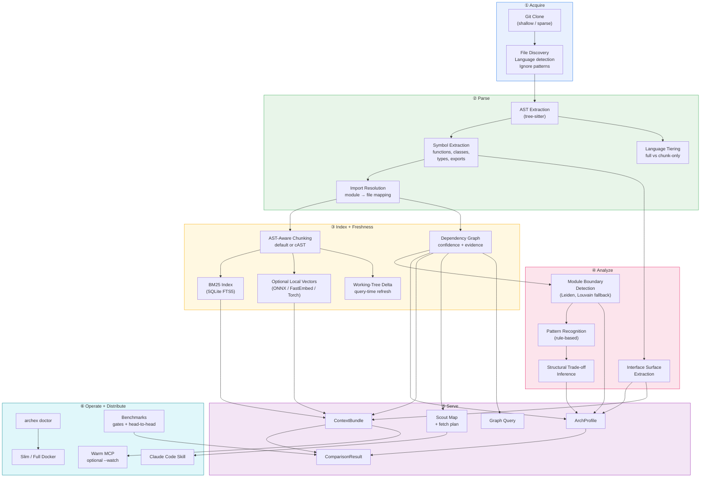
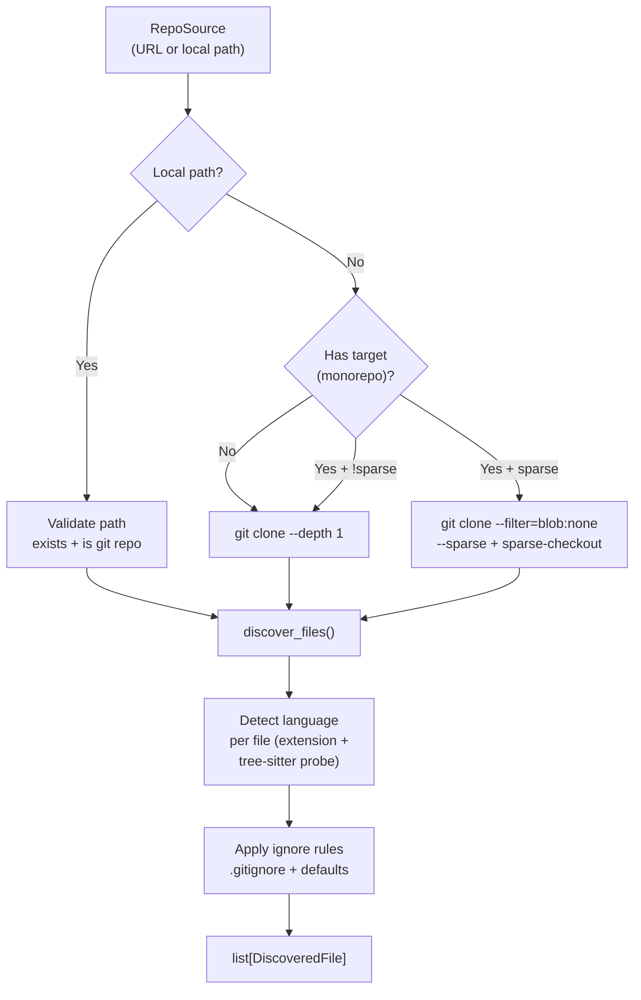
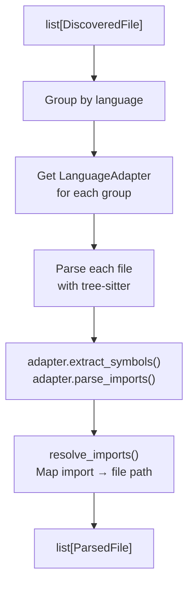
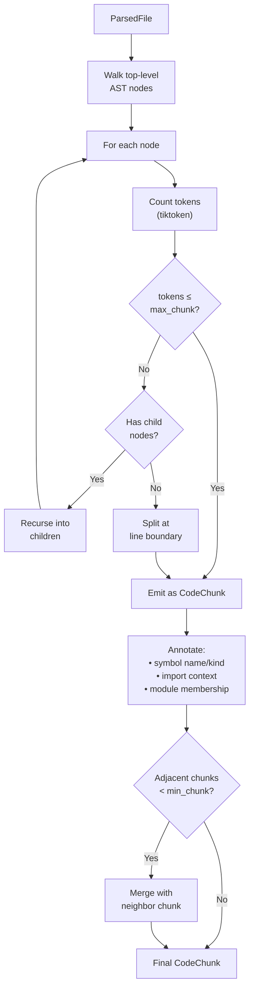
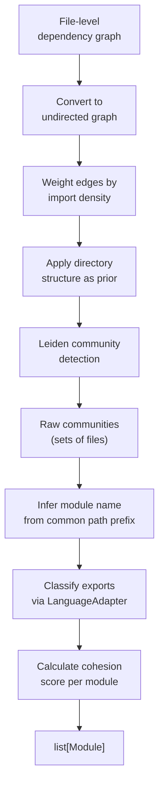
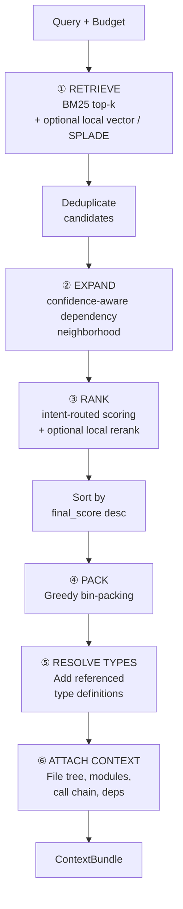
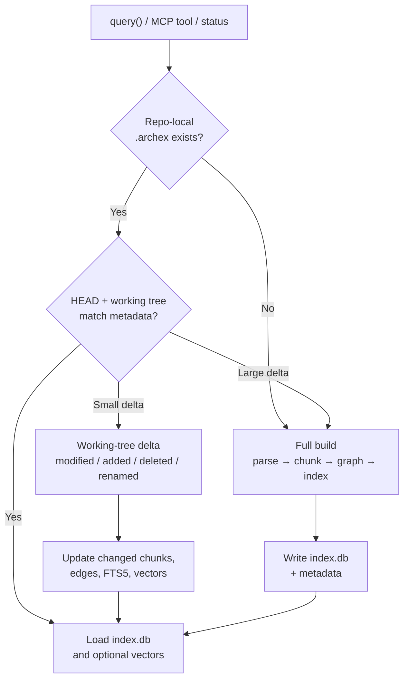

# archex — System Design

> Complete architecture, data models, workflows, and technical decisions.

---

## 1. Architecture

### 1.1 Pipeline Overview

archex operates as a local-first pipeline with explicit operating surfaces. Each stage produces inspectable artifacts under repo-local `.archex/` state when the project is initialized.



### 1.2 Package Layout

```text
archex/
├── __init__.py             # Public re-exports: analyze, query, compare, scout
├── api.py                  # Top-level public API functions
├── config.py               # Config loading from user/project/env
├── models.py               # Shared Pydantic models
├── exceptions.py           # Structured exception hierarchy
├── project.py              # Repo-local .archex project state and paths
├── status.py               # Index freshness / health inspection
├── doctor.py               # Trust diagnostics for repo-local installs
├── onboarding.py           # Getting-started summaries and setup guidance
├── scout.py                # Structural scout map + fetch-plan protocol
├── precision.py            # Symbol / batch symbol lookup helpers
├── cache.py                # Index cache management
├── graph_query.py          # Graph-backed neighborhood queries
├── graph_artifact.py       # Saved graph artifact generation
├── observe.py              # Observability helpers
├── reporting.py            # Shared CLI/reporting utilities
│
├── acquire/                # ① Source Acquisition
│   ├── git.py              # clone_repo(), shallow_clone(), sparse_checkout()
│   ├── local.py            # open_local(), validate_repo_path()
│   └── discovery.py        # discover_files(), detect_languages(), apply_ignores()
│
├── parse/                  # ② AST Parsing & Symbol Extraction
│   ├── engine.py           # TreeSitterEngine: parse orchestration
│   ├── symbols.py          # extract_symbols() → list[Symbol]
│   ├── imports.py          # parse_imports(), resolve_imports()
│   └── adapters/           # Language-specific adapters + registry
│
├── pipeline/               # ③ Chunking policy and orchestration
│   ├── chunker.py          # Default and cAST chunkers
│   ├── service.py          # Chunking pipeline orchestration
│   └── models.py           # Chunking-specific models
│
├── index/                  # ④ Indexing & Retrieval Primitives
│   ├── bm25.py             # BM25Index: SQLite FTS5 wrapper
│   ├── vector.py           # Optional local embedding index
│   ├── fusion.py           # BM25/vector fusion
│   ├── rerank.py           # Optional local reranker
│   ├── splade.py           # Optional sparse retrieval path
│   ├── delta.py            # Delta re-indexing
│   ├── graph.py            # DependencyGraph: NetworkX wrapper
│   ├── store.py            # SQLite persistence for index artifacts
│   ├── chunker.py          # Compatibility shim into pipeline chunkers
│   └── embeddings/         # Local embedding backends
│
├── analyze/                # ⑤ Structural Analysis
│   ├── modules.py          # detect_modules() via Leiden with Louvain fallback
│   ├── patterns.py         # detect_patterns() via rule-based matching
│   ├── interfaces.py       # extract_interfaces() → public API surface
│   └── decisions.py        # infer_decisions() → trade-off analysis
│
├── serve/                  # ⑥ Output Assembly
│   ├── profile.py          # build_profile() → ArchProfile
│   ├── context.py          # assemble_context() → ContextBundle
│   ├── intent.py           # Query intent and budget heuristics
│   ├── compare/            # Dimension-specific comparison renderers
│   └── renderers/          # XML / Markdown / JSON output renderers
│
├── integrations/           # Optional ecosystem integrations
│   ├── mcp.py              # MCP tool definitions and stdio server
│   ├── langchain.py        # LangChain retriever
│   ├── llamaindex.py       # LlamaIndex query engine
│   └── lsap.py             # LSP-assisted type enrichment
│
├── benchmark/              # Retrieval evaluation, gating, and head-to-head runs
│   ├── runner.py           # Benchmark orchestration
│   ├── reporter.py         # Human-readable reports
│   ├── gate.py             # Baseline/regression gates
│   ├── strategies.py       # Retrieval strategies under test
│   └── headtohead.py       # archex vs ccc vs raw-ripgrep/read harness
│
└── cli/                    # Click entry points
    ├── main.py             # Root click group definition
    ├── init_cmd.py         # archex init
    ├── index_cmd.py        # archex index
    ├── status_cmd.py       # archex status
    ├── doctor_cmd.py       # archex doctor
    ├── query_cmd.py        # archex query
    ├── scout_cmd.py        # archex scout
    ├── symbol_cmd.py       # archex symbol
    ├── symbols_cmd.py      # archex symbols
    ├── analyze_cmd.py      # archex analyze
    ├── explain_cmd.py      # archex explain
    ├── impact_cmd.py       # archex impact
    ├── graph_cmd.py        # archex graph
    ├── outline_cmd.py      # archex outline
    ├── tree_cmd.py         # archex tree
    ├── compare_cmd.py      # archex compare
    ├── onboard_cmd.py      # archex onboard
    ├── mcp_cmd.py          # archex mcp
    ├── cache_cmd.py        # archex cache
    ├── reset_cmd.py        # archex reset
    ├── benchmark_cmd.py    # archex benchmark ...
    └── dogfood_cmd.py      # archex dogfood
```

### 1.2.1 Distribution Surfaces

- **CLI:** repo-local workflows run through `archex init/index/status/doctor/query/scout/...`.
- **MCP server:** `archex mcp` wraps the stdio server implemented in `integrations/mcp.py`.
- **Claude Code skill:** `skills/archex/` codifies the doctor-first, scout→fetch workflow for agents.
- **Containers:** `docker/Dockerfile.slim` ships BM25-only onboarding; `docker/Dockerfile.full` ships local FastEmbed without requiring a build-time model download.

### 1.2.2 Repo-Local Trust and Freshness

- **Repo-local state:** `archex init` creates `.archex/settings.toml`, `.archex/metadata.json`, `.archex/index.db`, `.archex/vectors/`, and dogfood history under the checked-out repository. `.archex/` is generated state and belongs in `.gitignore`.
- **Working-tree delta:** query and MCP paths can refresh modified, added, deleted, or renamed files without a full rebuild when the change set is below `delta_threshold`.
- **Warm MCP:** `archex mcp` keeps the process, index handles, and optional local model state warm across tool calls; `--watch` adds debounced filesystem refresh when the operator opts in.
- **Doctor:** `archex doctor` reports index health, staleness, local model cache presence, grammar availability by tier, MCP registration, and `.archex/` disk usage in text or JSON.

### 1.2.3 Language Capability Tiers

Language support is declared, not implied. `full` means symbol extraction, import extraction, and graph edges are implemented and tested. `chunk-only` means tree-sitter chunking plus retrieval, with no symbol/import graph claim.

| Tier | Languages |
| --- | --- |
| `full` | Python, JavaScript, TypeScript/TSX, Go, Rust, Java, Kotlin, C#, Swift |
| `chunk-only` | C, C++, PHP, Ruby, Scala, Lua, Bash/Shell, SQL, HTML, CSS, YAML, TOML, JSON, Markdown, Solidity |

Unknown files fall back to line-window chunking so they can still be found by BM25 without pretending to have structural edges.

### 1.2.4 Benchmark and Comparison Evidence

- **Retrieval gate:** product-default changes are gated by recall, required-file recall, missed-required-task rate, receipt accuracy when available, token efficiency after completion, F1, median latency, and p95 latency. `docs/RETRIEVAL_DEFAULT_DECISIONS.md` owns the default-strategy verdict and rationale.
- **Head-to-head harness:** `src/archex/benchmark/headtohead.py` and `benchmarks/headtohead/` run the same external-repo tasks through archex, `ccc`, and raw-ripgrep/read, then record cold-start, warm latency, recall, precision, F1, token efficiency, required-file recall, missed-file/task rates, receipt accuracy, completion-penalty tokens, and token efficiency after completion.
- **Comparison page:** `docs/ARCHEX_VS_COCOINDEX.md` publishes accepted C1 cells and capability evidence without re-measuring inside docs work.
- **Chunking A/B:** the benchmark runner records the chunker axis (`default` or `cast`) so stores and benchmark outputs built with different chunkers are not compared silently.

### 1.3 Dependency Architecture

```mermaid
graph BT
    subgraph Core["Core (always installed)"]
        Models["models.py"]
        Config["config.py"]
        Acquire["acquire/"]
        Parse["parse/"]
        IndexMod["index/<br/>(BM25 only)"]
        Analyze["analyze/"]
        Serve["serve/"]
        CLI["cli/"]
    end

    subgraph External["External Dependencies"]
        TSLP["tree-sitter-language-pack"]
        YAML["pyyaml"]
        Rich["rich"]
        Watchdog["watchdog"]
        TS["tree-sitter"]
        TK["tiktoken"]
        PD["pydantic"]
        NX["networkx"]
        CK["click"]
        SQ["sqlite3 (stdlib)"]
    end

    subgraph Optional["Optional Extras"]
        Fast["FastEmbed<br/>(archex[vector-fast])"]
        GraphExtra["python-igraph + leidenalg<br/>(archex[graph])"]
        Torch["sentence-transformers / torch<br/>(archex[vector-torch])"]
        SPLADE["SPLADE deps<br/>(archex[splade])"]
        MCPExtra["MCP SDK<br/>(archex[mcp])"]
        LSAP["LSP client<br/>(archex[lsap])"]
    end

    Parse --> TS
    Parse --> TSLP
    CLI --> YAML
    CLI --> Rich
    CLI --> Watchdog
    Serve --> TK
    Models --> PD
    IndexMod --> NX
    CLI --> CK
    IndexMod --> SQ

    style Core fill:#e8f0fe,stroke:#1a73e8
    style Optional fill:#fff8e1,stroke:#f9ab00
```



---

## 2. Data Models

All models use Pydantic v2 for validation, serialization, and schema generation.

### 2.1 Core Input Models

```python
class RepoSource:
    """Input source specification."""
    url: str | None              # Git URL (https or ssh)
    local_path: Path | None      # Local directory path
    target: str | None           # Sub-path for monorepo scoping
    commit: str | None           # Pin to specific commit (default: HEAD)
    sparse: bool = False         # Use sparse checkout for monorepos

class Config:
    """Library-level configuration."""
    languages: list[str] | None = None          # Restrict to specific languages
    depth: Literal["shallow", "full"] = "full"  # Analysis depth
    cache: bool = True                          # Enable index caching
    cache_dir: str = "~/.archex/cache"          # User cache unless repo-local overrides it
    max_file_size: int = 10_000_000
    parallel: bool = False
    strict: bool = False
    delta_threshold: float = 0.5                # Full rebuild threshold for changed files

class IndexConfig:
    """Index construction configuration."""
    bm25: bool = True                           # Enable BM25 keyword index
    vector: bool = False                        # Enable local vector embedding index
    splade: bool = False                        # Enable optional local sparse retrieval
    module_prefilter: bool = False
    embedder: str | None = None                 # Registered local embedder name
    vector_mode: VectorMode = VectorMode.RAW
    retrieval_policy: RetrievalPolicy = RetrievalPolicy.AUTO
    rerank: bool = False                        # Optional local cross-encoder rerank
    rerank_model: str | None = None
    chunker: Literal["default", "cast"] = "default"
    chunk_max_tokens: int = 500
    chunk_min_tokens: int = 50
    token_encoding: str = "cl100k_base"
```

### 2.2 Intermediate Models (Pipeline Outputs)

```python
class RepoMetadata:
    """Metadata about a cloned/opened repository."""
    url: str | None
    local_path: Path
    commit_hash: str
    languages: dict[str, int]    # language → file count
    total_files: int
    total_lines: int

class ParsedFile:
    """A single file after AST parsing."""
    path: str                    # Relative path within repo
    language: str                # Detected language
    symbols: list[Symbol]        # Extracted symbols
    imports: list[ImportStatement]
    lines: int
    tokens: int                  # Estimated token count

class Symbol:
    """A named code entity extracted from the AST."""
    name: str                    # Symbol name (e.g., "ConnectionPool")
    qualified_name: str          # Fully qualified (e.g., "httpx._pool.ConnectionPool")
    kind: SymbolKind             # function | class | type | variable | constant | interface
    file_path: str
    start_line: int
    end_line: int
    visibility: Visibility       # public | internal | private
    signature: str | None        # Function signature or class declaration line
    docstring: str | None
    decorators: list[str]        # @staticmethod, @dataclass, etc.
    parent: str | None           # Enclosing class/module qualified name

class SymbolKind(StrEnum):
    FUNCTION = "function"
    CLASS = "class"
    METHOD = "method"
    TYPE = "type"
    VARIABLE = "variable"
    CONSTANT = "constant"
    INTERFACE = "interface"
    ENUM = "enum"
    MODULE = "module"

class Visibility(StrEnum):
    PUBLIC = "public"
    INTERNAL = "internal"
    PRIVATE = "private"

class ImportStatement:
    """A parsed import statement."""
    module: str                  # The imported module/package
    symbols: list[str]           # Specific imported symbols (empty = whole module)
    alias: str | None            # Import alias (as)
    file_path: str               # File containing this import
    line: int
    is_relative: bool            # Relative import (Python: from . import x)
    resolved_path: str | None    # Resolved file path within repo (None if external)
```

### 2.3 Index Models

```python
class CodeChunk:
    """A syntax-aligned unit of source code."""
    id: str                      # Unique chunk identifier
    content: str                 # The actual source code
    file_path: str
    start_line: int
    end_line: int
    symbol_name: str | None      # Enclosing symbol name
    symbol_kind: SymbolKind | None
    language: str
    imports_context: str         # Relevant import lines prepended
    token_count: int
    module: str | None           # Assigned module name

class Edge:
    """A directed dependency edge with evidence quality."""
    source: str
    target: str
    kind: EdgeKind               # imports | calls | inherits | implements | uses_type | co_directory | exports
    location: str | None
    confidence: EdgeConfidence = EdgeConfidence.EXTRACTED
    confidence_score: float = 1.0
    evidence: list[str] = []

class EdgeKind(StrEnum):
    IMPORTS = "imports"
    CALLS = "calls"
    INHERITS = "inherits"
    IMPLEMENTS = "implements"
    USES_TYPE = "uses_type"
    EXPORTS = "exports"
```

### 2.4 Output Models

#### ArchProfile (Human-Facing)

```python
class ArchProfile:
    """Complete architectural intelligence for a codebase."""
    repo: RepoMetadata
    module_map: list[Module]
    dependency_graph: DependencyGraphSummary  # Serializable summary
    pattern_catalog: list[DetectedPattern]
    interface_surface: list[Interface]
    decision_log: list[ArchDecision]
    stats: CodebaseStats

    def to_dict(self) -> dict: ...
    def to_markdown(self) -> str: ...
    def to_json(self) -> str: ...

class Module:
    """A detected logical module within the codebase."""
    name: str
    root_path: str
    files: list[str]
    exports: list[SymbolRef]     # References to public symbols
    internal_deps: list[str]     # Dependencies on other detected modules
    external_deps: list[str]     # Third-party package dependencies
    responsibility: str | None   # Deterministic structural summary when available
    cohesion_score: float        # Intra-module coupling density (0-1)
    file_count: int
    line_count: int

class DetectedPattern:
    """An architectural pattern found in the codebase."""
    name: str                    # e.g., "middleware_chain"
    display_name: str            # e.g., "Middleware Chain"
    confidence: float            # 0.0 - 1.0
    evidence: list[PatternEvidence]
    description: str
    category: PatternCategory    # structural | behavioral | creational

class PatternEvidence:
    """Supporting evidence for a pattern detection."""
    file_path: str
    start_line: int
    end_line: int
    symbol: str
    explanation: str             # Why this code supports the pattern

class PatternCategory(StrEnum):
    STRUCTURAL = "structural"
    BEHAVIORAL = "behavioral"
    CREATIONAL = "creational"

class Interface:
    """A public-facing API contract."""
    symbol: SymbolRef
    signature: str
    parameters: list[Parameter]
    return_type: str | None
    docstring: str | None
    used_by: list[str]           # Internal consumers

class ArchDecision:
    """An inferred architectural trade-off."""
    decision: str
    alternatives: list[str]
    evidence: list[str]          # File paths + code locations
    implications: list[str]
    source: Literal["structural", "llm_inferred"]

class CodebaseStats:
    total_files: int
    total_lines: int
    languages: dict[str, LanguageStats]
    module_count: int
    symbol_count: int
    external_dep_count: int
    internal_edge_count: int

class LanguageStats:
    files: int
    lines: int
    symbols: int
    percentage: float            # Percentage of total lines
```

#### ContextBundle (Agent-Facing)

```python
class ContextBundle:
    """Token-budget-aware code context for agent consumption."""
    query: str
    chunks: list[RankedChunk]
    structural_context: StructuralContext
    type_definitions: list[TypeDefinition]
    dependency_summary: DependencySummary
    token_count: int
    token_budget: int
    truncated: bool
    retrieval_metadata: RetrievalMetadata

    def to_prompt(self, format: str = "xml") -> str: ...
    def to_dict(self) -> dict: ...

class RankedChunk:
    """A code chunk with retrieval scoring."""
    chunk: CodeChunk
    relevance_score: float       # BM25 / vector similarity score
    structural_score: float      # PageRank centrality
    type_coverage_score: float   # How many referenced types are included
    final_score: float           # Weighted composite

class StructuralContext:
    """Lightweight structural metadata for agent orientation."""
    relevant_modules: list[str]
    entry_points: list[str]
    call_chain: list[str] | None
    file_tree: str               # ASCII file tree of relevant files
    file_dependency_subgraph: dict[str, list[str]]

class TypeDefinition:
    """A type/interface definition included for reference."""
    symbol: str
    file_path: str
    start_line: int
    end_line: int
    content: str
    referenced_by: list[str]     # Chunks that reference this type

class DependencySummary:
    """Summary of dependencies relevant to the query."""
    internal: list[str]          # Internal modules/symbols involved
    external: list[str]          # Third-party packages involved

class RetrievalMetadata:
    """Diagnostics about the retrieval process."""
    candidates_found: int
    candidates_after_expansion: int
    chunks_included: int
    chunks_dropped: int
    strategy: str                # "bm25" | "vector" | "hybrid" | "graph"
    retrieval_time_ms: float
    assembly_time_ms: float
```

#### ComparisonResult

```python
class ComparisonResult:
    """Cross-repo architectural comparison."""
    repo_a: RepoMetadata
    repo_b: RepoMetadata
    dimensions: list[DimensionComparison]
    summary: str                 # Deterministic renderer summary

class DimensionComparison:
    """Comparison along a single architectural dimension."""
    dimension: str               # e.g., "error_handling"
    repo_a_approach: str         # Description of repo A's approach
    repo_b_approach: str         # Description of repo B's approach
    evidence_a: list[str]        # File paths + code refs from repo A
    evidence_b: list[str]        # File paths + code refs from repo B
    trade_offs: list[str]        # Key differences and their implications
```

---

## 3. Stage-by-Stage Design

### 3.1 Stage ① — Acquire

**Responsibility:** Clone or open a repository, enumerate source files, detect languages, apply ignore rules.



**Default ignore rules** (applied in addition to `.gitignore`):

```python
DEFAULT_IGNORES = [
    "node_modules/", ".git/", "__pycache__/", ".venv/", "venv/",
    "dist/", "build/", ".next/", ".nuxt/", "target/",
    "*.min.js", "*.min.css", "*.map", "*.lock",
    "package-lock.json", "bun.lock", "yarn.lock", "pnpm-lock.yaml",
    "*.pb.go", "*_generated.*", "*.g.dart",      # Generated code
    "vendor/", "third_party/",                     # Vendored deps
    "*.svg", "*.png", "*.jpg", "*.gif", "*.ico",  # Binary/media
    "*.wasm", "*.pyc", "*.so", "*.dylib",          # Compiled artifacts
]
```

**Monorepo detection:**

```python
MONOREPO_SIGNALS = {
    "turbo.json": "turborepo",
    "nx.json": "nx",
    "lerna.json": "lerna",
    "pnpm-workspace.yaml": "pnpm",
    "pants.toml": "pants",
    "BUILD": "bazel",
    "WORKSPACE": "bazel",
}

def detect_monorepo(repo_path: Path) -> MonorepoInfo | None:
    """Detect monorepo structure and sub-package locations."""
    # 1. Check for known tool configs
    # 2. Check for workspace declarations in package.json / Cargo.toml / go.work
    # 3. Count package manifests at different directory levels
    # Returns MonorepoInfo with tool, workspace_root, sub_packages
```

### 3.2 Stage ② — Parse

**Responsibility:** Parse source files into ASTs, extract symbols and imports, resolve import paths to files within the repo.



**LanguageAdapter Protocol:**

```python
class LanguageAdapter(Protocol):
    language_id: str
    file_extensions: list[str]
    tree_sitter_name: str

    def extract_symbols(self, tree: Tree, source: bytes, file_path: str) -> list[Symbol]:
        """Extract all named symbols from the AST."""
        ...

    def parse_imports(self, tree: Tree, source: bytes, file_path: str) -> list[ImportStatement]:
        """Extract and parse all import statements."""
        ...

    def resolve_import(
        self, imp: ImportStatement, file_map: dict[str, Path]
    ) -> str | None:
        """Resolve an import to a file path within the repo. None if external."""
        ...

    def detect_entry_points(self, files: list[ParsedFile]) -> list[str]:
        """Identify application entry points."""
        ...

    def classify_visibility(self, symbol: Symbol) -> Visibility:
        """Determine if a symbol is public, internal, or private."""
        ...
```

**Python adapter — symbol extraction via tree-sitter queries:**

```python
# tree-sitter query patterns for Python symbol extraction
PYTHON_QUERIES = {
    "functions": """
        (function_definition
            name: (identifier) @name
            parameters: (parameters) @params
            return_type: (type)? @return_type
            body: (block) @body
        ) @definition
    """,
    "classes": """
        (class_definition
            name: (identifier) @name
            superclasses: (argument_list)? @bases
            body: (block) @body
        ) @definition
    """,
    "imports": """
        [
            (import_statement) @import
            (import_from_statement) @import
        ]
    """,
    "type_aliases": """
        (type_alias_statement
            name: (type) @name
            value: (type) @value
        ) @definition
    """,
}
```

**Import resolution strategy (Python-specific):**

```text
from httpx._pool import ConnectionPool
  → module = "httpx._pool"
  → symbols = ["ConnectionPool"]
  → Check: is "httpx" a directory in the repo?
    → Yes → resolved_path = "httpx/_pool.py"
    → No  → resolved_path = None (external dependency)

from . import _pool
  → Relative import from current package
  → resolved_path = resolve relative to importing file's directory

import asyncio
  → stdlib → resolved_path = None (external)
```

### 3.3 Stage ③ — Index

**Responsibility:** Chunk parsed files into syntax-aligned units, build dependency graph, construct BM25 and optional vector indexes, persist to SQLite.

#### 3.3.1 AST-Aware Chunking



**Chunking rules:**

| Rule                    | Behavior                                                                                                                                            |
| ----------------------- | --------------------------------------------------------------------------------------------------------------------------------------------------- |
| **Boundary alignment**  | Chunks always start/end at AST node boundaries (function, class, type def, top-level statement)                                                     |
| **Import prepending**   | Each chunk includes relevant import lines as prefix (imports that resolve to symbols used in the chunk)                                             |
| **Class handling**      | Small classes (≤ max_chunk): one chunk for the whole class. Large classes: one chunk per method, with the class header + `__init__` always included |
| **Decorator inclusion** | Decorators are always included with their target symbol                                                                                             |
| **Comment association** | Leading comment blocks (docstrings, header comments) stay with their associated symbol                                                              |
| **Merge threshold**     | Adjacent chunks below `min_chunk` tokens are merged, respecting a combined max of `max_chunk * 1.5`                                                 |

#### 3.3.2 Dependency Graph Construction

```python
class DependencyGraph:
    """Multi-level dependency graph backed by NetworkX."""

    def __init__(self):
        self._file_graph = nx.DiGraph()      # File A → File B (imports)
        self._symbol_graph = nx.DiGraph()    # Symbol A → Symbol B (calls, inherits, etc.)

    @classmethod
    def from_parsed_files(cls, files: list[ParsedFile]) -> "DependencyGraph":
        """Construct graph from parsed files with resolved imports."""
        graph = cls()
        for f in files:
            graph._file_graph.add_node(f.path)
            for imp in f.imports:
                if imp.resolved_path:
                    graph._file_graph.add_edge(
                        f.path, imp.resolved_path,
                        kind="imports", symbols=imp.symbols
                    )
            for sym in f.symbols:
                graph._symbol_graph.add_node(sym.qualified_name, file=f.path)
        # Second pass: resolve symbol-level edges
        # (calls, inherits, uses_type from AST analysis)
        return graph

    def detect_modules(self, directory_prior: dict[str, str] | None = None) -> list[Module]:
        """Leiden community detection with directory bias and Louvain fallback."""
        ...

    def subgraph_for_files(self, files: list[str]) -> "DependencyGraph":
        """Extract subgraph containing only specified files + their edges."""
        ...

    def neighborhood(self, symbol: str, hops: int = 1) -> set[str]:
        """Return all symbols within N hops (both directions)."""
        predecessors = set(nx.ancestors(self._symbol_graph, symbol)) if hops > 0 else set()
        successors = set(nx.descendants(self._symbol_graph, symbol)) if hops > 0 else set()
        # Filter to within hop limit via BFS
        ...

    def structural_centrality(self) -> dict[str, float]:
        """PageRank-based importance scores for all symbols."""
        return nx.pagerank(self._symbol_graph, alpha=0.85)

    def to_sqlite(self, conn: sqlite3.Connection) -> None: ...

    @classmethod
    def from_sqlite(cls, conn: sqlite3.Connection) -> "DependencyGraph": ...
```

#### 3.3.3 BM25 Index

Uses SQLite FTS5 (full-text search) — zero external dependencies, built into Python's `sqlite3`.

```sql
-- Schema
CREATE VIRTUAL TABLE chunks_fts USING fts5(
    chunk_id,
    content,
    symbol_name,
    file_path,
    tokenize='porter unicode61'
);

-- Query (BM25 ranking is built into FTS5)
SELECT chunk_id, rank
FROM chunks_fts
WHERE chunks_fts MATCH ?
ORDER BY rank
LIMIT ?;
```

#### 3.3.4 Vector Index

Optional, activated via `IndexConfig(vector=True)`.

```python
class VectorIndex:
    """Simple embedding-based similarity search."""

    def __init__(self, embedder: Embedder):
        self.embedder = embedder
        self.vectors: np.ndarray | None = None  # (n_chunks, dim)
        self.chunk_ids: list[str] = []

    def build(self, chunks: list[CodeChunk]) -> None:
        texts = [c.imports_context + "\n" + c.content for c in chunks]
        self.vectors = self.embedder.embed(texts)
        self.chunk_ids = [c.id for c in chunks]

    def search(self, query: str, top_k: int = 20) -> list[tuple[str, float]]:
        query_vec = self.embedder.embed([query])[0]
        similarities = self.vectors @ query_vec  # Cosine sim (vectors are normalized)
        top_indices = np.argsort(similarities)[::-1][:top_k]
        return [(self.chunk_ids[i], float(similarities[i])) for i in top_indices]

    def save(self, path: Path) -> None:
        np.save(path / "vectors.npy", self.vectors)
        (path / "chunk_ids.json").write_text(json.dumps(self.chunk_ids))

    @classmethod
    def load(cls, path: Path, embedder: Embedder) -> "VectorIndex": ...
```

#### 3.3.5 Index Persistence (SQLite)

Single SQLite database per indexed repo:

```sql
-- Chunks table
CREATE TABLE chunks (
    id TEXT PRIMARY KEY,
    content TEXT NOT NULL,
    file_path TEXT NOT NULL,
    start_line INTEGER NOT NULL,
    end_line INTEGER NOT NULL,
    symbol_name TEXT,
    symbol_kind TEXT,
    language TEXT NOT NULL,
    imports_context TEXT,
    token_count INTEGER NOT NULL,
    module TEXT
);

-- Symbols table
CREATE TABLE symbols (
    qualified_name TEXT PRIMARY KEY,
    name TEXT NOT NULL,
    kind TEXT NOT NULL,
    file_path TEXT NOT NULL,
    start_line INTEGER,
    end_line INTEGER,
    visibility TEXT,
    signature TEXT,
    docstring TEXT,
    parent TEXT
);

-- Edges table
CREATE TABLE edges (
    source TEXT NOT NULL,
    target TEXT NOT NULL,
    kind TEXT NOT NULL,
    location TEXT,
    confidence TEXT NOT NULL DEFAULT 'extracted',
    confidence_score REAL NOT NULL DEFAULT 1.0,
    evidence TEXT NOT NULL DEFAULT '[]',
    PRIMARY KEY (source, target, kind)
);

-- Metadata table
CREATE TABLE metadata (
    key TEXT PRIMARY KEY,
    value TEXT NOT NULL
);
-- Keys: commit_hash, indexed_at, config_hash, languages, stats, chunker, chunker_revision

-- FTS5 index (see BM25 section above)
```

### 3.4 Stage ④ — Analyze

**Responsibility:** Detect module boundaries, recognize architectural patterns, extract public interface surface, infer trade-offs.

#### 3.4.1 Module Boundary Detection



**Edge weighting:**

```python
def weight_file_edge(source: str, target: str, edge_data: dict) -> float:
    """Weight an edge for community detection."""
    base = 1.0
    # More imported symbols = stronger coupling
    base += len(edge_data.get("symbols", [])) * 0.5
    # Same directory = bias toward same module
    if Path(source).parent == Path(target).parent:
        base *= 1.5
    return base
```

**Cohesion score:** Ratio of intra-module edges to total edges touching the module. High cohesion (>0.7) means the module is well-bounded. Low cohesion (<0.3) suggests the module may need splitting.

#### 3.4.2 Pattern Recognition

Rule-based detection operating on the dependency graph structure and AST node signatures.

```python
class PatternDetector(Protocol):
    """Interface for all pattern detectors."""
    name: str
    display_name: str
    category: PatternCategory

    def detect(
        self,
        graph: DependencyGraph,
        symbols: list[Symbol],
        modules: list[Module],
    ) -> DetectedPattern | None:
        """Return a DetectedPattern if found, None otherwise."""
        ...
```

**Shipped detectors:**

| Pattern                                | Detection Strategy                                                                                                                                                                                               |
| -------------------------------------- | ---------------------------------------------------------------------------------------------------------------------------------------------------------------------------------------------------------------- |
| **Middleware Chain**                   | Find linear call chains where each function has signature `(request, next_handler)` or `(ctx, next)`. Chain length ≥ 3 required. Confidence scales with chain length.                                            |
| **Plugin / Extension System**          | Registry pattern: a collection (dict/list) that accepts heterogeneous callables sharing a common interface. Look for `register()` / `add()` methods that accept callables or classes implementing a shared base. |
| **Event Bus / Pub-Sub**                | Emit/subscribe pairs. Functions named `emit`/`dispatch`/`publish` + `on`/`subscribe`/`listen`. String-keyed dispatch to callback collections.                                                                    |
| **Repository / DAO**                   | Classes whose methods map to CRUD operations (get/list/create/update/delete). Constructor takes a connection/client/session parameter.                                                                           |
| **Strategy Pattern**                   | Multiple concrete implementations of the same abstract base class or protocol. Runtime selection via factory or config.                                                                                          |
| **Builder Pattern**                    | Method chaining returning `self`. Fluent API with a terminal `build()` / `create()` / `compile()` method.                                                                                                        |
| **Dependency Injection**               | Constructor parameters typed as protocols/abstract base classes. External wiring in a composition root file.                                                                                                     |
| **Pipeline / Chain of Responsibility** | Sequential processing stages with uniform input/output types. Each stage transforms data and passes to next.                                                                                                     |
| **Factory Pattern**                    | Functions or methods that return instances of different concrete types based on input parameters. Centralized creation logic.                                                                                    |
| **Singleton / Module-Level State**     | Module-level instances, `_instance` patterns, `__new__` overrides, or global configuration objects.                                                                                                              |

### 3.5 Stage ⑤ — Serve

**Responsibility:** Assemble `ArchProfile`, `ContextBundle`, `ScoutMap`, graph-query responses, and `ComparisonResult`; render deterministic XML, Markdown, JSON, or table outputs.

#### 3.5.1 ContextBundle Assembly (Token Budget Packing)



**Pack algorithm detail:**

```python
def pack_context(
    ranked_chunks: list[RankedChunk],
    type_defs: dict[str, TypeDefinition],
    budget: int,
) -> tuple[list[RankedChunk], list[TypeDefinition], int]:
    """Greedy bin-packing with overlap detection."""

    included_chunks: list[RankedChunk] = []
    included_types: list[TypeDefinition] = []
    included_content: set[str] = set()  # For overlap detection
    remaining = budget

    # Reserve ~15% of budget for structural context preamble
    reserved_for_context = int(budget * 0.15)
    remaining -= reserved_for_context

    for chunk in ranked_chunks:
        if remaining <= 0:
            break

        # Skip if >80% content overlap with already-included chunk
        if _overlap_ratio(chunk.chunk.content, included_content) > 0.8:
            continue

        chunk_cost = chunk.chunk.token_count

        # Include referenced type definitions not yet added
        referenced_types = _find_referenced_types(chunk.chunk, type_defs)
        type_cost = sum(
            td.token_count for td in referenced_types
            if td.symbol not in {t.symbol for t in included_types}
        )

        total_cost = chunk_cost + type_cost
        if total_cost > remaining:
            # Try without types
            if chunk_cost <= remaining:
                total_cost = chunk_cost
                referenced_types = []
            else:
                continue

        included_chunks.append(chunk)
        included_types.extend(referenced_types)
        included_content.add(chunk.chunk.content)
        remaining -= total_cost

    tokens_used = budget - remaining
    return included_chunks, included_types, tokens_used
```

#### 3.5.2 Prompt Rendering (XML Format)

```xml
<codebase_context repo="{repo_url}" commit="{commit_hash}" query="{query}">

<file_map>
{ascii_file_tree_of_relevant_files}
</file_map>

<module_context>
Relevant modules: {comma_separated_module_names}
Entry point: {entry_point_symbol}
Call chain: {A → B → C → D}
</module_context>

<chunks>
<chunk file="{path}" lines="{start}-{end}" symbol="{name}" type="{kind}" relevance="{score:.2f}">
{source_code_with_imports_prepended}
</chunk>
<!-- ... more chunks ordered by relevance ... -->
</chunks>

<types>
<type file="{path}" lines="{start}-{end}" symbol="{name}">
{full_type_definition}
</type>
<!-- ... referenced type definitions ... -->
</types>

<dependencies>
Internal: {comma_separated_internal_deps}
External: {comma_separated_external_packages}
</dependencies>

</codebase_context>
```


#### 3.5.3 Scout and Graph Query Surfaces

`archex scout` and the MCP `scout_repo` flow split exploration from content consumption. The scout response contains a token-light file tree, relevant modules, top symbols, graph-neighborhood hints, and a `fetch_plan` of stable handles. Agents then fetch exact symbols, files, or bundles instead of reading broad files speculatively.

Graph-native commands and MCP tools answer structural questions directly from an exported graph artifact or persisted index: neighbors, shortest path, stats, hubs, and exact node lookup. Output includes edge kind, confidence, score, and evidence so callers can distinguish extracted syntax edges from heuristic relationships.

---

## 4. Storage Architecture

### 4.1 Cache Layout

```text
.archex/                         # repo-local generated state
├── settings.toml                 # Project settings created by `archex init`
├── metadata.json                 # archex version and project metadata
├── index.db                      # SQLite: chunks, symbols, edges, FTS5, metadata
├── vectors/                      # Optional local embedding artifacts
└── dogfood/
    └── history/                  # Local dogfood result history

~/.archex/
├── config.toml                   # User-level defaults
├── cache/                        # Remote-repo and non-project cache entries
└── models/                       # Optional local model caches
    ├── fastembed/
    ├── sentence-transformers/
    └── splade/
```

### 4.2 Cache Invalidation



### 4.3 Cache Identity Strategy

Repo-local mode uses the repository root plus `.archex/settings.toml` as the durable identity. Benchmark and remote-repo cache identities include the source identity, target path, retrieval strategy, embedder, vector mode, chunker, chunker revision, and config hash. The chunker axis is part of the identity so `default` and `cast` stores are never reused across each other silently.

---

## 5. Error Handling

### 5.1 Exception Hierarchy

```python
class ArchexError(Exception):
    """Base exception for all archex errors."""

class AcquireError(ArchexError):
    """Errors during source acquisition."""

class CloneError(AcquireError):
    """Git clone failed (network, auth, not found)."""
    url: str
    exit_code: int
    stderr: str

class PrivateRepoError(AcquireError):
    """Repository requires authentication."""
    url: str

class ParseError(ArchexError):
    """Errors during AST parsing."""

class UnsupportedLanguageError(ParseError):
    """No adapter registered for this language."""
    language: str
    file_path: str

class IndexError(ArchexError):
    """Errors during index construction."""

class ProviderError(ArchexError):
    """Errors from optional model providers or legacy provider integrations."""
    provider: str
    status_code: int | None

class CacheError(ArchexError):
    """Errors reading/writing the index cache."""
```

### 5.2 Graceful Degradation

| Failure                    | Behavior                                                       |
| -------------------------- | -------------------------------------------------------------- |
| Single file fails to parse | Skip file, log warning, continue with remaining files          |
| Unknown language           | Use chunk-only or line-window indexing without graph claims    |
| Import resolution fails    | Mark edge unresolved or omit the graph edge                    |
| Optional local model build fails | Fail the requested vector/rerank path clearly; BM25-only runs remain available |
| Cache corrupted            | Report through status/doctor; rebuild only when explicitly run |
| Token budget too small     | Return what fits, set `truncated=True`                         |

---

## 6. Performance Considerations

### 6.1 Expected Performance

| Repo Size                  | Files | Parse Time | Index Time | Query Time |
| -------------------------- | ----- | ---------- | ---------- | ---------- |
| Small (e.g., click)        | ~50   | < 1s       | < 1s       | < 200ms    |
| Medium (e.g., httpx)       | ~200  | 2-5s       | 2-3s       | < 500ms    |
| Large (e.g., FastAPI)      | ~500  | 5-10s      | 5-8s       | < 1s       |
| Very Large (e.g., Next.js) | ~5000 | 30-60s     | 20-40s     | 1-3s       |

_Parse + index is a one-time cost, amortized by caching. Query time is per-request._

### 6.2 Optimization Strategies

| Strategy                        | Where Applied                                                      |
| ------------------------------- | ------------------------------------------------------------------ |
| **Shallow clone** (`--depth 1`) | Acquire: skip git history, clone only HEAD                         |
| **Sparse checkout**             | Acquire: clone only targeted monorepo sub-package                  |
| **Parallel file parsing**       | Parse: `concurrent.futures.ProcessPoolExecutor` for AST extraction |
| **Cached graph artifacts**      | Index/Graph: reuse persisted SQLite/graph artifacts and warm MCP state |
| **FTS5 for BM25**               | Index: SQLite handles lexical ranking natively, no Python-side inverted index |
| **Batch local embedding**       | Index: optional vector paths batch ONNX/FastEmbed/Torch embedding work |
| **Working-tree delta**          | Index: re-parse changed files only when the delta is below threshold |
| **Lazy optional indexes**       | Query: vector/SPLADE/rerank paths load only when explicitly enabled |

---

## 7. Security Considerations

| Concern                    | Mitigation                                                                                                                                                                       |
| -------------------------- | -------------------------------------------------------------------------------------------------------------------------------------------------------------------------------- |
| **Arbitrary repo cloning** | Validate URL format. Only support https:// and git:// protocols. Block file:// and ssh:// by default (configurable).                                                             |
| **Path traversal**         | All file paths are resolved relative to clone root. Reject paths containing `..`.                                                                                                |
| **Prompt injection boundary** | archex emits structured evidence and never treats repository text as instructions. Downstream agents decide how to consume the bundle. |
| **Secret posture**           | No hosted inference or API key is required for core, MCP, skill, Docker slim, or benchmark-gate workflows. User config stays local. |
| **Disk space**             | Default cache TTL of 7 days. `archex cache clean` for manual management. Warning at 5GB total cache size.                                                                        |
| **No code execution**      | archex never executes cloned code. No `eval()`, no subprocess calls on repo content. Tree-sitter parsing is static analysis only.                                                |
